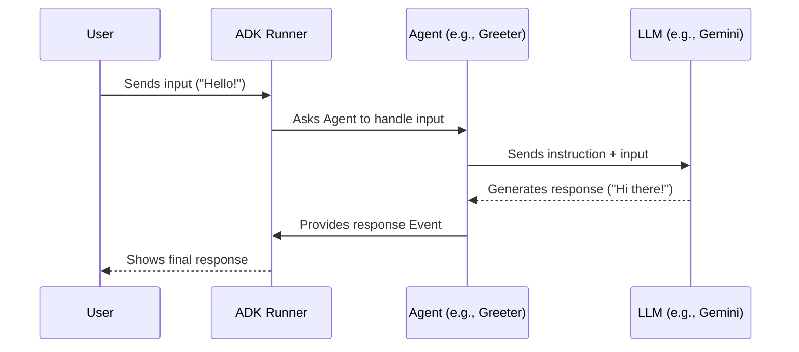

# Chapter 1: Agent - Your Specialized AI Worker

Welcome to the Agent Development Kit (ADK) for Python! We're excited to help you build amazing AI-powered applications. This is the very first step on your journey.

Imagine you want to build an AI assistant. Maybe it tells jokes, summarizes articles, or helps you plan trips. How do you organize the different parts of this assistant? How do you tell each part what to do?

This is where the **Agent** comes in. Think of an Agent as the fundamental building block in the ADK – like a specialized worker or assistant designed for a specific job.

## What is an Agent?

At its core, an **Agent** is a component that can:

1.  Receive some input (like a user's message).
2.  Perform a task based on that input and its instructions.
3.  Produce an output (like a response to the user).

Think of real-world examples:

*   A **receptionist** greets visitors and directs them.
*   A **researcher** takes a question, finds information, and writes a summary.
*   A **chef** takes an order and prepares a dish.

In the ADK, Agents can be simple or complex:

*   **Simple Agents:** Follow a fixed set of pre-defined steps. (We'll touch on these later).
*   **Complex Agents (LLM-powered):** Use a Large Language Model (LLM) – like Google's Gemini models – to understand instructions, process input, and decide what to do next. This is what we'll focus on most!

Agents are the heart of your AI application. Let's build our very first one!

## Your First Agent: The Friendly Greeter

Let's create a simple Agent whose only job is to greet the user politely. We'll use the `LlmAgent` class for this, which is designed to work with LLMs.

```python
# Import the necessary class from the ADK
from google.adk.agents import LlmAgent

# Create our first Agent instance
greeting_agent = LlmAgent(
    name="Greeter",
    description="Politely greets the user.",
    # Tell the LLM *how* to act
    instruction="You are a friendly assistant. Greet the user warmly.",
    # Specify which LLM to use (we'll cover models more later)
    model="gemini-1.5-flash" 
)

# In a real application, we would now 'run' this agent.
# We'll learn how to do that in the next chapter!
print(f"Created Agent named: {greeting_agent.name}")
```

Let's break down this code:

1.  `from google.adk.agents import LlmAgent`: We import the `LlmAgent` class, which is the standard type of agent that uses an LLM to decide what to do. You can find this in `src/google/adk/agents/llm_agent.py`.
2.  `greeting_agent = LlmAgent(...)`: We create an instance of the `LlmAgent`.
3.  `name="Greeter"`: We give our agent a unique name. This helps us identify it later, especially if we have many agents. Names must be valid Python identifiers (letters, numbers, underscores, not starting with a number) and cannot be "user". (Defined in `BaseAgent` from `src/google/adk/agents/base_agent.py`).
4.  `description="Politely greets the user."`: A short description of what the agent does. This can be helpful for more complex scenarios where one agent might need to understand what another agent can do. (Also in `BaseAgent`).
5.  `instruction="You are a friendly assistant. Greet the user warmly."`: This is crucial! It's the instruction we give to the LLM, guiding its behavior. When this agent runs, the ADK will use this instruction (along with user input) when talking to the LLM.
6.  `model="gemini-1.5-flash"`: We specify which LLM this agent should use. If you don't specify a model here, the agent might inherit one from a parent agent (we'll discuss parent agents soon).

If a user were to interact with this agent (we'll see *how* in the next chapter on the [Runner](02_runner.md)), the flow would look something like this:

*   **User:** "Hello there!"
*   **ADK (using `greeting_agent`):** (Sends the instruction and user message to the Gemini 1.5 Flash model)
*   **LLM:** (Generates a response based on the instruction "Greet the user warmly.")
*   **ADK (from `greeting_agent`):** "Hi there! It's great to hear from you. How can I help today?" (or a similar warm greeting)

## Agents Can Work in Teams (Hierarchy)

Just like in a company, you can have teams of Agents. One Agent can be a "parent" agent (like a manager) that has "sub-agents" (like team members).

*   A **parent agent** can coordinate work and potentially delegate tasks to its specialized **sub-agents**.
*   For example, you might have a `TravelPlanner` agent (parent) that uses a `FlightFinder` agent and a `HotelBooker` agent (sub-agents).

You define this relationship using the `sub_agents` parameter when creating an agent.

```python
# (Imagine we already defined FlightFinder and HotelBooker agents)
# from .my_agents import flight_finder_agent, hotel_booker_agent 

# travel_planner_agent = LlmAgent(
#     name="TravelPlanner",
#     description="Helps plan trips by finding flights and hotels.",
#     instruction="You are a helpful travel planner.",
#     model="gemini-1.5-pro",
#     # This agent manages the sub-agents
#     sub_agents=[flight_finder_agent, hotel_booker_agent] 
# )
```

In this (simplified) example, the `TravelPlanner` agent knows about the `FlightFinder` and `HotelBooker`. When using an `LlmAgent` as a parent, the LLM can often figure out *when* to delegate tasks to the appropriate sub-agent based on their descriptions and the ongoing conversation.

## How Agents Get Things Done: Instructions and Tools

We've seen the `instruction` parameter – it's the primary way you define *how* an `LlmAgent` should behave.

But what if an agent needs to do something more than just talk? What if it needs to:

*   Search the web?
*   Calculate something?
*   Look up information in a database?
*   Execute code?

Agents can use **Tools** to interact with the outside world or perform specific, non-LLM tasks. We'll dive deep into Tools in the [Tool](04_tool.md) chapter, but just know that they give your agents superpowers beyond simple conversation.

## Under the Hood (A Quick Peek)

You don't need to know all the internal details right now, but it helps to have a basic idea of what happens when an agent runs.

All agents, whether simple or LLM-powered, inherit from a common `BaseAgent` class (found in `src/google/adk/agents/base_agent.py`). This class defines the fundamental structure and methods like `run_async`.

When you run an `LlmAgent` (like our `greeting_agent`), the ADK framework typically does the following (simplified):

1.  **Prepare:** Gathers the agent's instructions, the conversation history, available tools, and the latest user input.
2.  **Call LLM:** Sends this information to the specified LLM (e.g., Gemini).
3.  **Process Response:** Gets the response from the LLM. This might be text to send back to the user, or it might be a request to use a Tool or delegate to a sub-agent.
4.  **Execute (if needed):** If the LLM asked to use a Tool, the ADK runs the tool and gets the result.
5.  **Repeat/Respond:** If a tool was used, the result might be sent back to the LLM for further processing (Step 2). Otherwise, the final response is prepared.
6.  **Output:** The final result (e.g., a message for the user) is generated as an [Event](08_event.md).

Here's a very simplified diagram:



We'll explore the `Runner` and `Event` concepts in later chapters.

## Other Agent Types

While `LlmAgent` is the most common and powerful type, the ADK provides other "structural" agents (defined in `src/google/adk/agents/__init__.py`) that help organize how sub-agents run:

*   `SequentialAgent`: Runs its sub-agents one after the other, in order.
*   `ParallelAgent`: Runs its sub-agents all at the same time (in parallel).
*   `LoopAgent`: Runs its sub-agents repeatedly in a loop until a condition is met.

These are useful for building more complex workflows by composing agents together.

## Conclusion

You've learned about the most fundamental concept in the ADK: the **Agent**.

*   Agents are specialized workers for specific tasks.
*   `LlmAgent` uses Large Language Models and is configured primarily through `instructions`.
*   Agents can have `sub_agents`, forming hierarchies for complex tasks.
*   Agents can use [Tools](04_tool.md) to interact with the world (more on this later!).

You've created your first simple `LlmAgent`, the "Greeter". But how do you actually make it *run* and interact with a user? For that, we need the **Runner**.

Let's move on to the next chapter to find out!

**Next:** [Chapter 2: Runner](02_runner.md)

---

Generated by [AI Codebase Knowledge Builder](https://github.com/The-Pocket/Tutorial-Codebase-Knowledge)