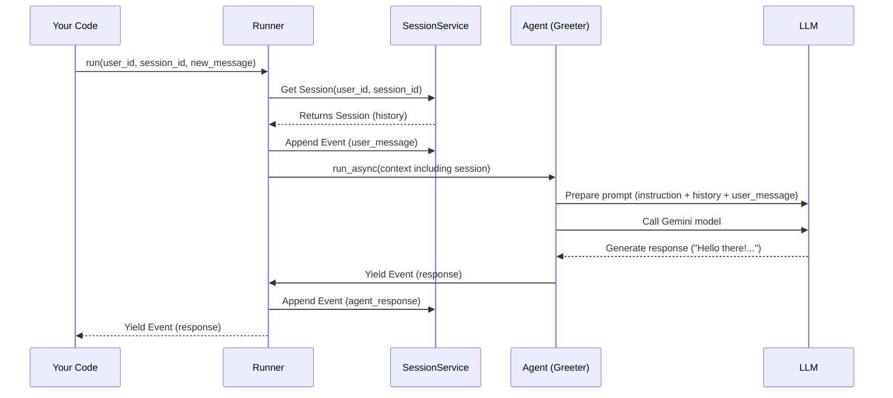

# Chapter 2: Runner - The Agent's Manager

In [Chapter 1: Agent](01_agent.md), we learned how to create an **Agent**, our specialized AI worker. We built a friendly `Greeter` agent. But how do we actually put that Agent to work? How does it receive a user's message and generate a response?

That's where the **Runner** comes in!

## Meet the Manager: What is a Runner?

Imagine you have a skilled worker (the Agent). You need someone to manage the interaction between a customer (the user) and the worker. This manager needs to:

1.  Receive the customer's request ("Hello!").
2.  Know which worker (Agent) should handle this request (in simple cases, it's just our main Agent).
3.  Keep track of the conversation history so the worker has context.
4.  Give the request and context to the worker.
5.  Collect the worker's output (the response or actions taken).
6.  Deliver the final response back to the customer.

In the ADK, the **Runner** is this manager. It's the engine responsible for taking a user's input, coordinating with the correct Agent, managing the conversation's state ([Session](03_session.md)), and overseeing the entire execution process. It collects the results, which come in the form of [Events](08_event.md).

## Putting the Greeter Agent to Work

Let's take our `Greeter` agent from Chapter 1 and use a Runner to make it respond to a user.

For simplicity, we'll use a special type of Runner called `InMemoryRunner`. This version keeps track of conversation history (the [Session](03_session.md)) directly in the computer's memory, which is perfect for getting started and testing. More advanced Runners might store this information in databases.

```python
# --- Agent definition (from Chapter 1) ---
from google.adk.agents import LlmAgent
from google.adk.providers.vertexai import VertexAIProvider # Need this for model access
from google.genai import types as genai_types # To create user messages

# Configure model access (replace with your project details if needed)
# This might require authentication in a real environment.
# For simplicity, we assume default environment authentication works.
VertexAIProvider.configure() 

greeting_agent = LlmAgent(
    name="Greeter",
    description="Politely greets the user.",
    instruction="You are a friendly assistant. Greet the user warmly.",
    model="gemini-1.5-flash" 
)
print(f"Created Agent named: {greeting_agent.name}")

# --- Now, let's use the Runner ---
from google.adk.runners import InMemoryRunner # Import the simple Runner

# 1. Create an InMemoryRunner instance, telling it which agent to manage
runner = InMemoryRunner(agent=greeting_agent) 
print("Created an InMemoryRunner.")

# 2. Define who the user is and the conversation ID
user_id = "user_123"
session_id = "conversation_abc"

# 3. Create the user's message
user_message = genai_types.Content(
    role="user", parts=[genai_types.Part(text="Hi there!")]
)
print(f"Prepared user message: {user_message.parts[0].text}")

# 4. Run the agent via the Runner!
print("\nRunning the agent...")
event_stream = runner.run(
    user_id=user_id,
    session_id=session_id,
    new_message=user_message
)

# 5. Process the results (Events)
for event in event_stream:
    print(f"  -> Received Event from: {event.author}")
    # We'll learn more about Events later, for now just print the text
    if event.content and event.content.parts:
        print(f"     Content: {event.content.parts[0].text}") 
```

**What's happening here?**

1.  **Agent Setup:** We recreate our `Greeter` agent (and importantly, configure the `VertexAIProvider` so the ADK knows how to talk to the Gemini model).
2.  **Import `InMemoryRunner`:** We bring in the necessary class from `google.adk.runners`.
3.  **Create Runner:** We instantiate `InMemoryRunner`, passing our `greeting_agent` to it. Now the runner knows which agent is the main "entry point".
4.  **Identify User/Session:** We define a `user_id` and `session_id`. The Runner uses these to keep conversations separate. Think of `session_id` like a unique chat window identifier.
5.  **Create Message:** We format the user's input ("Hi there!") using `genai_types.Content`. This is the standard way to represent messages in the ADK.
6.  **`runner.run(...)`:** This is the key step! We tell the runner to execute the agent for the specified user and session, providing the new message.
7.  **Process Events:** The `run` method doesn't just return one final answer. It returns a *generator* that `yield`s [Events](08_event.md). An event could be a text response, a request to use a tool, or other intermediate steps. Our simple loop prints the author (who generated the event, e.g., 'Greeter' or 'user') and the text content of each event.

**Example Output (might vary slightly due to the LLM):**

```
Created Agent named: Greeter
Created an InMemoryRunner.
Prepared user message: Hi there!

Running the agent...
  -> Received Event from: Greeter
     Content: Hello there! It's lovely to hear from you. How can I help you today?
```

You successfully used the Runner to manage an interaction with your Agent! The Runner handled getting the message to the Agent, the Agent used the LLM based on its instructions, and the Runner delivered the final response event back to you.

## How Does the Runner Work? (A Peek Inside)

You don't need to memorize this, but understanding the basic flow helps. When you call `runner.run()` (or the asynchronous `runner.run_async()` which is often used in real applications), here's a simplified version of what happens:

1.  **Find/Create Session:** The Runner uses the `user_id` and `session_id` to ask the `SessionService` (in our case, the `InMemorySessionService`) for the conversation history ([Session](03_session.md)). If it's a new `session_id`, a new session is created.
2.  **Add User Message:** The `new_message` from the user is added to the session history.
3.  **Determine Agent:** The Runner figures out which Agent should handle the message. For a new conversation, it's usually the main `agent` you provided when creating the Runner. In more complex scenarios with agent hierarchies, it might choose a different agent based on the conversation history.
4.  **Create Context:** It gathers everything the Agent needs: the session history, the user message, configuration settings, etc., into an `InvocationContext`. (We'll cover [Invocation Context](07_invocation_context.md) later).
5.  **Execute Agent:** The Runner calls the chosen Agent's `run_async` method, passing the `InvocationContext`.
6.  **Process Agent Output:** The Agent performs its task (e.g., calls the LLM). As the Agent works, it generates one or more [Events](08_event.md) (like the text response).
7.  **Yield Events:** The Runner receives these events from the Agent and `yield`s them back to your code (the `for event in event_stream:` loop).
8.  **Update Session:** Non-partial events generated by the agent are saved back to the session history via the `SessionService`.

Here's a diagram illustrating this flow:



The actual `Runner` class (in `src/google/adk/runners.py`) coordinates these steps, interacting with services like the `SessionService` and potentially an `ArtifactService` (for handling files, see [Artifact Service](10_artifact_service.md)) and `MemoryService` (for long-term memory, not covered yet).

```python
# Simplified view inside src/google/adk/runners.py

class Runner:
  # ... (stores agent, services)

  def __init__(self, ..., agent: BaseAgent, session_service: BaseSessionService, ...):
      self.agent = agent
      self.session_service = session_service
      # ... other services

  async def run_async(self, *, user_id, session_id, new_message, ...) -> AsyncGenerator[Event, None]:
      # 1. Get the session
      session = self.session_service.get_session(...)
      if not session:
          raise ValueError("Session not found")

      # 2. Append user message to session
      if new_message:
          self._append_new_message_to_session(session, new_message, ...)

      # 3. Find the right agent to run (often the root agent)
      agent_to_run = self._find_agent_to_run(session, self.agent)

      # 4. Create execution context
      invocation_context = self._new_invocation_context(session, new_message, ...)
      invocation_context.agent = agent_to_run

      # 5. Run the agent and yield events
      async for event in agent_to_run.run_async(invocation_context):
          # 8. Save agent events back to session
          if not event.partial:
              self.session_service.append_event(session=session, event=event)
          # 7. Yield event back to the caller
          yield event

  # The sync `run` method wraps `run_async` using threads/asyncio
  def run(self, ...) -> Generator[Event, None, None]:
      # ... code to run _invoke_run_async in a separate thread ...
      # ... yield events from a queue filled by the async version ...
      pass

# The InMemoryRunner just sets up the in-memory services
class InMemoryRunner(Runner):
    def __init__(self, agent: LlmAgent, ...):
        super().__init__(
            agent=agent,
            session_service=InMemorySessionService(), # Uses memory-based session storage
            artifact_service=InMemoryArtifactService(), # Uses memory-based file storage
            # ...
        )

```

## Conclusion

The **Runner** is the essential engine that brings your Agents to life. It acts as the manager, handling user requests, managing conversation context via the [Session](03_session.md), invoking the appropriate Agent, and delivering the results as a stream of [Events](08_event.md).

You've learned how to use the simple `InMemoryRunner` to execute your `Greeter` agent and see it respond.

Now that we understand how the Runner manages the *process* of a conversation, let's dive deeper into *how* it keeps track of that conversation history.

**Next:** [Chapter 3: Session - Remembering the Conversation](03_session.md)

---

Generated by [AI Codebase Knowledge Builder](https://github.com/The-Pocket/Tutorial-Codebase-Knowledge)