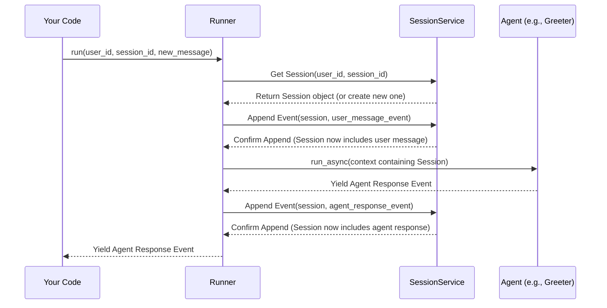

# Chapter 3: Session - Remembering the Conversation

In [Chapter 1: Agent](01_agent.md), we met our AI worker, the Agent. In [Chapter 2: Runner](02_runner.md), we learned about the Runner, the manager that directs the Agent and handles user interaction.

But imagine having a conversation where the other person forgets everything you just said. It wouldn't be very useful! If you ask our `Greeter` agent "What's my name?" after telling it your name, how can it possibly remember?

This is where the **Session** comes in. It's the memory of the conversation.

## Why Do We Need Memory?

Think about any chat application you use. It keeps a history of your messages and the replies. Without that history, every message would be like starting a brand new conversation.

In the ADK, an Agent needs context to be helpful. It needs to know:

*   What did the user say earlier?
*   What did the Agent say earlier?
*   Are there any temporary pieces of information we need to remember for this specific chat (like the user's name, a temporary calculation, or a file they uploaded)?

The **Session** object is designed to hold all this information for a *single, specific conversation* between a user and the agent system.

## What is a Session?

A **Session** is like the combined chat history and temporary notepad for one conversation thread. It holds:

1.  **Conversation History:** A list of all the [Events](08_event.md) that have happened – user messages, agent responses, tool actions (we'll learn about [Tools](04_tool.md) soon!). This provides the context for the Agent.
2.  **Conversation State:** A place to store temporary information relevant *only* to this conversation. Think of it like variables or a scratchpad. For example, if the user says "My name is Alex", the agent might store `{"user_name": "Alex"}` in the session state.
3.  **Identifiers:** Information about *who* is talking (`user_id`) and *which specific conversation* this is (`session_id`).

Here's a peek at the structure defined in `src/google/adk/sessions/session.py`:

```python
# Simplified structure from src/google/adk/sessions/session.py
from pydantic import BaseModel, Field
from typing import Any, List
from google.adk.events import Event # Assuming Event is defined

class Session(BaseModel):
  id: str # Unique ID for this specific conversation
  app_name: str # Which application this session belongs to
  user_id: str # Who is the user in this conversation
  state: dict[str, Any] = Field(default_factory=dict) # The temporary notepad
  events: List[Event] = Field(default_factory=list) # The chat history
  last_update_time: float = 0.0 # When was this session last touched
```

*   `id`: A unique identifier like `conversation_abc` from our Runner example.
*   `app_name`: Identifies the overall application (e.g., "MyTravelAgent").
*   `user_id`: Identifies the end-user (e.g., `user_123`).
*   `state`: A dictionary (key-value pairs) acting as the notepad.
*   `events`: A list containing the sequence of [Events](08_event.md) (user messages, agent replies, etc.).
*   `last_update_time`: A timestamp indicating the last activity.

## The Session's Notepad: State

The `state` dictionary within the Session is a powerful concept. It allows the Agent (or Tools) to store and retrieve information during the conversation.

Imagine you're building a pizza ordering agent:

1.  **User:** "I want to order a pizza."
2.  **Agent:** "Okay! What size?"
3.  **User:** "Large."
4.  **Agent:** (Stores `{"pizza_size": "Large"}` in the session `state`) "Got it. What toppings?"
5.  **User:** "Pepperoni."
6.  **Agent:** (Adds `{"pizza_toppings": ["Pepperoni"]}` to the session `state`) "Okay, one large pizza with pepperoni. Ready to order?"

Later, when confirming the order, the agent can look back at the `state` to recall the size and toppings.

**State Scopes (Advanced Sneak Peek):**

Sometimes, you might want to store information that lasts longer than just one session. The ADK allows for different "scopes" of state using special prefixes (defined in `src/google/adk/sessions/state.py`):

*   **Session State (Default):** No prefix (e.g., `pizza_size`). Lasts only for the current session.
*   **User State (`user:`):** e.g., `user:delivery_address`. Stored per user, potentially across multiple sessions.
*   **App State (`app:`):** e.g., `app:menu_version`. Shared across all users and sessions of the application.
*   **Temporary State (`temp:`):** e.g., `temp:intermediate_calculation`. Used during a single agent turn, usually not saved permanently in the session.

For now, just remember the basic session `state` is like a temporary notepad for the current chat.

## Where are Sessions Kept? The SessionService

Okay, so we have this `Session` object holding our conversation memory. But where does it live? How does the [Runner](02_runner.md) find the right session when the user sends a new message?

This is the job of the **Session Service**. Think of it as the filing cabinet system for all conversations. Its main tasks are:

*   **Creating** new sessions when a conversation starts.
*   **Retrieving (Getting)** existing sessions based on `app_name`, `user_id`, and `session_id`.
*   **Updating** sessions (e.g., adding new [Events](08_event.md) or changing the `state`).
*   **Listing** sessions for a user.
*   **Deleting** sessions.

The core interface for this is `BaseSessionService` (defined in `src/google/adk/sessions/base_session_service.py`).

```python
# Simplified interface from src/google/adk/sessions/base_session_service.py
import abc
from typing import Optional, Any
from .session import Session # Assuming Session is defined
from ..events import Event # Assuming Event is defined

class BaseSessionService(abc.ABC):

    @abc.abstractmethod
    def create_session(self, *, app_name: str, user_id: str, ...) -> Session:
        # Creates and stores a new session
        pass

    @abc.abstractmethod
    def get_session(self, *, app_name: str, user_id: str, session_id: str, ...) -> Optional[Session]:
        # Retrieves a specific session from storage
        pass

    @abc.abstractmethod
    def list_sessions(self, *, app_name: str, user_id: str, ...) -> list[Session]:
        # Lists sessions for a user (often without events/state for efficiency)
        pass

    @abc.abstractmethod
    def delete_session(self, *, app_name: str, user_id: str, session_id: str) -> None:
        # Removes a session from storage
        pass

    # This method is often implemented in the base class or specific services
    def append_event(self, session: Session, event: Event) -> Event:
        # Adds a new event to the session's history and updates state
        # This typically updates the session both in memory AND in storage.
        pass
```

### Different Filing Cabinets (Session Service Implementations)

Just like you can store files in different places (on your desk, in a filing cabinet, in the cloud), the ADK provides different ways to store sessions:

1.  **`InMemorySessionService`** (`src/google/adk/sessions/in_memory_session_service.py`):
    *   Keeps all sessions directly in the computer's RAM.
    *   **Analogy:** Sticky notes on your monitor.
    *   **Pros:** Very fast, great for testing and simple examples.
    *   **Cons:** All session data is lost when the application stops or restarts.
    *   This is what the `InMemoryRunner` we used in [Chapter 2](02_runner.md) uses by default.

2.  **`DatabaseSessionService`** (`src/google/adk/sessions/database_session_service.py`):
    *   Stores session data in a relational database (like PostgreSQL, MySQL, SQLite) using SQLAlchemy.
    *   **Analogy:** A sturdy metal filing cabinet.
    *   **Pros:** Persistent storage (data survives restarts), robust, scalable.
    *   **Cons:** Requires setting up a database, slightly slower than in-memory.

3.  **`VertexAiSessionService`** (`src/google/adk/sessions/vertex_ai_session_service.py`):
    *   Stores session data using Google Cloud's managed Vertex AI Agent Builder infrastructure (Reasoning Engine Sessions).
    *   **Analogy:** Cloud storage like Google Drive, managed for you.
    *   **Pros:** Persistent, scalable, managed by Google Cloud, integrates with other Vertex AI features.
    *   **Cons:** Requires using Google Cloud Platform.

When you create a [Runner](02_runner.md), you typically tell it which `SessionService` implementation to use. The `InMemoryRunner` conveniently bundles the `InMemorySessionService`.

## How the Runner Uses the Session

Let's revisit the [Runner](02_runner.md) example and see where the Session fits in.

```python
# --- Runner Example Snippet (from Chapter 2) ---
# (Agent definition, imports, etc. omitted for brevity)
# from google.adk.runners import InMemoryRunner
# from google.genai import types as genai_types

# runner = InMemoryRunner(agent=greeting_agent) # Uses InMemorySessionService internally

# user_id = "user_123"
# session_id = "conversation_abc" # The ID for our specific chat

# user_message = genai_types.Content(...)

# event_stream = runner.run(
#     user_id=user_id,
#     session_id=session_id, # Tells the runner WHICH conversation memory to use
#     new_message=user_message
# )

# for event in event_stream:
#     # Process events...
#     pass
```

When you call `runner.run(...)`:

1.  **Get Session:** The `Runner` takes the `user_id` and `session_id` and asks its configured `SessionService` (here, `InMemorySessionService`) to retrieve the `Session` object for `conversation_abc`. If it doesn't exist, the `SessionService` might create a new one.
2.  **Update Session (User Message):** The `Runner` (via the `SessionService`) adds the `new_message` (formatted as an [Event](08_event.md)) to the `session.events` list.
3.  **Pass to Agent:** The `Runner` passes the entire `Session` object (including the updated `events` list and the current `state`) to the `greeting_agent` as part of the execution context. The agent now knows the history!
4.  **Agent Responds:** The `greeting_agent` generates its response (as another [Event](08_event.md)).
5.  **Update Session (Agent Message):** The `Runner` receives the agent's response event and tells the `SessionService` to append *this* event to the `session.events` list and save any state changes.
6.  **Yield Event:** The `Runner` yields the agent's response event back to your code.

The Session is constantly being read from and updated throughout the process, managed by the Runner and the Session Service.

## Internal Flow: Runner, SessionService, and Agent

Here's a simplified diagram showing how these components interact when a user sends a message:



## Peeking Inside the Code

You don't need to implement these yourself right now, but seeing the structure helps:

**1. The Session Data Structure:**

```python
# Simplified from src/google/adk/sessions/session.py
class Session(BaseModel):
  id: str
  app_name: str
  user_id: str
  state: dict[str, Any] = Field(default_factory=dict)
  events: list[Event] = Field(default_factory=list)
  last_update_time: float = 0.0
```

**2. The In-Memory Storage:**

The `InMemorySessionService` uses Python dictionaries to hold everything in RAM.

```python
# Simplified concept from src/google/adk/sessions/in_memory_session_service.py
class InMemorySessionService(BaseSessionService):
    def __init__(self):
        # { app_name: { user_id: { session_id: Session_Object } } }
        self.sessions: dict[str, dict[str, dict[str, Session]]] = {}
        # Other dictionaries to store app_state and user_state...

    def get_session(self, *, app_name, user_id, session_id, ...) -> Optional[Session]:
        # Look up the session in the nested dictionaries
        session = self.sessions.get(app_name, {}).get(user_id, {}).get(session_id)
        if session:
            # Return a copy to avoid accidental modification outside append_event
            return copy.deepcopy(session)
        return None

    def append_event(self, session: Session, event: Event) -> Event:
        # Find the actual session object in storage
        storage_session = self.sessions.get(session.app_name, {}).get(session.user_id, {}).get(session.id)
        if storage_session:
            # Update the stored session's events and state based on the event
            if not event.partial: # Only add non-partial events to history
                storage_session.events.append(event)
                # Logic to update storage_session.state based on event.actions.state_delta...
            storage_session.last_update_time = event.timestamp
        # Also update the passed-in session object (which is often a copy)
        session.events.append(event)
        # Logic to update session.state...
        session.last_update_time = event.timestamp
        return event

    # ... implementations for create, list, delete ...
```

The `DatabaseSessionService` and `VertexAiSessionService` have similar methods but interact with databases or cloud APIs instead of Python dictionaries.

## Conclusion

The **Session** is the memory of a conversation in the ADK. It holds the history of [Events](08_event.md) and the temporary `state` (notepad) for a specific interaction between a user and the agent system.

The **Session Service** (`InMemorySessionService`, `DatabaseSessionService`, etc.) is responsible for storing, retrieving, and updating these Sessions.

The [Runner](02_runner.md) uses the Session Service to fetch the correct Session context before calling the [Agent](01_agent.md) and to save the results afterward. Without the Session, agents would have no memory, making meaningful conversation impossible.

Now that our agents can remember things, what if they need to *do* things beyond just talking? What if they need to look up information, perform calculations, or interact with other software? For that, we need Tools.

**Next:** [Chapter 4: Tool - Giving Agents Superpowers](04_tool.md)

---

Generated by [AI Codebase Knowledge Builder](https://github.com/The-Pocket/Tutorial-Codebase-Knowledge)