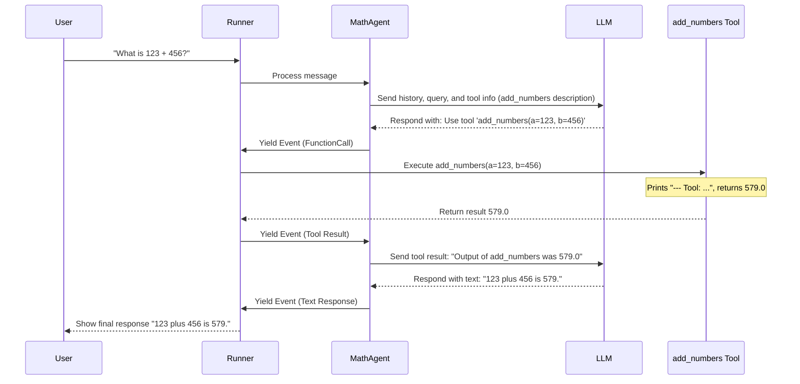

# Chapter 4: Tool - Giving Agents Superpowers

In the previous chapters, we learned about the [Agent](01_agent.md) (our AI worker), the [Runner](02_runner.md) (the manager), and the [Session](03_session.md) (the conversation memory). Our agents can now chat and remember the conversation.

But what if we want our agent to *do* more than just talk? Imagine asking an agent:

*   "What's the weather like in London right now?"
*   "Calculate the square root of 144."
*   "Search the web for recent news about AI."
*   "Book a flight for me."

While a powerful Large Language Model (LLM) might *try* to answer these, it doesn't have real-time access to weather data, a built-in calculator guaranteed to be accurate, or the ability to browse the live web or interact with booking systems. It's primarily trained on text data from the past.

To give our agents these kinds of abilities, we need **Tools**.

## Use Case: The Calculator Agent

Let's imagine we want an agent that's really good at math. While an LLM *can* do some calculations, it might make mistakes, especially with complex math. It's much more reliable to use actual code for calculations.

How can we give our agent a reliable calculator? We can create a **Tool** for it!

## What is a Tool?

Think of an Agent as a worker. A **Tool** is like specialized equipment that the worker can use to perform specific tasks they can't do with their bare hands (or just by talking).

*   A construction worker might have a hammer, a saw, and a measuring tape.
*   A chef might have knives, whisks, and ovens.
*   An ADK Agent might have a **Calculator Tool**, a **Web Search Tool**, an **API Caller Tool**, or even a **Tool that runs code**.

Tools allow agents to:

*   Interact with the outside world (e.g., search engines, databases, APIs).
*   Perform precise computations or logic using code.
*   Fetch up-to-date information.
*   Execute actions in other systems.

The ADK provides ways to define your own custom tools or use pre-built ones. Let's create our first custom tool: a simple calculator.

## Creating a Simple Tool: `FunctionTool`

The easiest way to create a custom tool in the ADK is by using `FunctionTool`. This lets you wrap any regular Python function and make it available to your agent.

**Step 1: Define the Python Function**

First, let's write a simple Python function that adds two numbers. Crucially, we need to add a **docstring** explaining what the function does and what its parameters are. The LLM will use this docstring to understand when and how to use the tool!

```python
# Our simple function to add two numbers
def add_numbers(a: float, b: float) -> float:
  """
  Calculates the sum of two numbers.

  Args:
      a: The first number.
      b: The second number.

  Returns:
      The sum of a and b.
  """
  print(f"--- Tool: Calculating {a} + {b} ---")
  result = a + b
  print(f"--- Tool: Result is {result} ---")
  return result

# Test the function directly (optional)
# sum_result = add_numbers(5, 7)
# print(f"Direct function call result: {sum_result}") 
```

*   We define a standard Python function `add_numbers`.
*   We use type hints (`a: float`, `b: float`, `-> float`) which help `FunctionTool` understand the expected input and output types.
*   **The docstring is very important!** It serves as the `description` for the tool that the LLM sees. It needs to be clear and accurately describe the function's purpose and arguments.

**Step 2: Wrap the Function with `FunctionTool`**

Now, we import `FunctionTool` from the ADK and wrap our function.

```python
from google.adk.tools import FunctionTool

# Create a tool instance from our function
calculator_tool = FunctionTool(add_numbers)

print(f"Created tool named: '{calculator_tool.name}'")
print(f"Tool description: {calculator_tool.description}") 
```

*   `from google.adk.tools import FunctionTool`: We import the necessary class (found in `src/google/adk/tools/function_tool.py`).
*   `calculator_tool = FunctionTool(add_numbers)`: We create an instance of `FunctionTool`, passing our `add_numbers` function to it.
*   By default, `FunctionTool` uses the function's name (`add_numbers`) as the tool's `name` and the function's docstring as its `description`. You *can* override these by passing `name` and `description` arguments to `FunctionTool` if needed, but using the function's own name and docstring is usually best.

That's it! We've created a usable Tool.

## Using the Tool with an Agent

Now, let's give this `calculator_tool` to an `LlmAgent`.

```python
# --- Assuming previous setup: imports, VertexAIProvider.configure() ---
from google.adk.agents import LlmAgent
from google.adk.runners import InMemoryRunner
from google.genai import types as genai_types

# Define the Agent, now including the 'tools' parameter
math_agent = LlmAgent(
    name="MathAgent",
    description="An agent that can perform calculations.",
    instruction="You are a helpful assistant. Use the available tools to answer calculation questions.",
    model="gemini-1.5-flash",
    # Give the agent access to our new tool!
    tools=[calculator_tool] 
)
print(f"Created Agent: {math_agent.name} with tool: {math_agent.tools[0].name}")

# --- Runner setup (as in Chapter 2) ---
runner = InMemoryRunner(agent=math_agent)
user_id = "user_calc"
session_id = "conversation_math"

# Ask a question that should use the tool
user_message = genai_types.Content(
    role="user", parts=[genai_types.Part(text="What is 123 plus 456?")]
)
print(f"User asks: {user_message.parts[0].text}")

# --- Run the agent ---
print("\nRunning the MathAgent...")
event_stream = runner.run(
    user_id=user_id, session_id=session_id, new_message=user_message
)

# Process the results
for event in event_stream:
    print(f"  -> Event from: {event.author}")
    if event.content and event.content.parts:
        # Check if it's a FunctionCall or text response
        if event.content.parts[0].function_call:
            fc = event.content.parts[0].function_call
            print(f"     Action: Requesting tool '{fc.name}' with args {fc.args}")
        elif event.content.parts[0].text:
            print(f"     Content: {event.content.parts[0].text}")
    # Also check for FunctionResults (output from the tool)
    if event.tool_code_outputs: 
        out = event.tool_code_outputs[0]
        print(f"     Tool Result ({out.tool_name}): {out.output}")
```

**What's happening here?**

1.  **Agent Creation:** We create `math_agent` similar to before, but we add the `tools=[calculator_tool]` argument. This tells the agent that the `add_numbers` tool is available.
2.  **Instruction:** We slightly modify the instruction to encourage tool use, although often the LLM can figure it out just from the tool's description and the user's query.
3.  **Runner:** We set up the `InMemoryRunner` as usual.
4.  **User Query:** The user asks "What is 123 plus 456?".
5.  **Running:** We call `runner.run(...)`.
6.  **Event Processing:** We loop through the events. This time, we add checks to see if an event contains a `function_call` (the LLM asking to use a tool) or `tool_code_outputs` (the result after the tool runs).

**Example Output (simplified, may vary):**

```
Created tool named: 'add_numbers'
Tool description: 
  Calculates the sum of two numbers.

  Args:
      a: The first number.
      b: The second number.

  Returns:
      The sum of a and b.
  
Created Agent: MathAgent with tool: add_numbers
User asks: What is 123 plus 456?

Running the MathAgent...
  -> Event from: MathAgent
     Action: Requesting tool 'add_numbers' with args {'a': 123.0, 'b': 456.0}
--- Tool: Calculating 123.0 + 456.0 ---  # Output from our print statement inside add_numbers
--- Tool: Result is 579.0 ---          # Output from our print statement inside add_numbers
  -> Event from: tool                 # Special author indicating a tool ran
     Tool Result (add_numbers): {'result': 579.0} 
  -> Event from: MathAgent
     Content: 123 plus 456 is 579.
```

Look at the sequence:

1.  The agent (`MathAgent`) decided it needed to use the `add_numbers` tool and requested it with the arguments `a=123.0` and `b=456.0`.
2.  The ADK framework intercepted this request, ran our actual `add_numbers` Python function (printing the "--- Tool: ..." lines).
3.  The result (`579.0`) was packaged as a tool output event.
4.  This result was automatically sent back to the `MathAgent`'s LLM for processing.
5.  The `MathAgent` then generated the final user-friendly response: "123 plus 456 is 579.".

Our agent successfully used a Tool to perform a calculation!

## How Tool Use Works: Function Calling

How does the LLM know *when* to use a tool and *which* tool to use? This process is often called **Function Calling** (or Tool Calling). Here's a simplified step-by-step:

1.  **LLM Request:** When the [Runner](02_runner.md) asks the [Agent](01_agent.md) to process the user's message, the ADK prepares a request for the LLM (e.g., Gemini). This request includes:
    *   The conversation history ([Session](03_session.md)).
    *   The latest user message.
    *   The agent's instructions.
    *   **Crucially:** A list of available **Tools**, including their names, descriptions (from the docstring!), and parameter details (derived from type hints).
2.  **LLM Decision:** The LLM analyzes the request. Based on the user's query and the descriptions of the available tools, it decides the best course of action:
    *   **Option A:** Respond directly with text.
    *   **Option B:** Use one of the available tools.
3.  **Tool Request (if Option B):** If the LLM decides to use a tool, its response *isn't* text for the user. Instead, it's a structured message saying, "I need to call tool `X` with arguments `Y`." For our example: "Call `add_numbers` with `{'a': 123, 'b': 456}`".
4.  **ADK Executes Tool:** The ADK framework receives this tool request from the LLM.
    *   It finds the corresponding `FunctionTool` object (our `calculator_tool`).
    *   It calls the tool's `run_async` method, passing the arguments (`{'a': 123, 'b': 456}`) provided by the LLM and a `ToolContext` object (which provides access to things like [Session](03_session.md) state).
    *   Our `add_numbers` function executes and returns the result (`579.0`).
5.  **Tool Result:** The ADK packages the function's return value into a special "tool result" message.
6.  **LLM Final Response:** The ADK sends this tool result back to the LLM in a new request, essentially saying, "Okay, I ran the `add_numbers` tool you asked for, and the result was `579.0`. What should we tell the user now?"
7.  **Generate Text:** The LLM uses the tool's result to formulate the final, natural language response for the user (e.g., "123 plus 456 is 579.").
8.  **ADK Delivers Response:** The ADK gets this final text response and yields it as an [Event](08_event.md) back to the calling code (our `for event in event_stream:` loop).

Here's a diagram showing this flow:



This back-and-forth between the LLM and the ADK executing tools allows agents to leverage external capabilities intelligently.

## Looking Inside the Code

You don't need to implement this yourself, but understanding the base structure helps.

**1. `BaseTool` (`src/google/adk/tools/base_tool.py`)**

All tools inherit from `BaseTool`. It defines the core interface.

```python
# Simplified from src/google/adk/tools/base_tool.py
from abc import ABC
from typing import Any, Optional
from google.genai import types
from .tool_context import ToolContext # We'll cover ToolContext later

class BaseTool(ABC):
  name: str          # Tool name (must be unique for an agent)
  description: str   # Description for the LLM
  is_long_running: bool = False # For tools that take time

  def __init__(self, *, name, description, ...):
      self.name = name
      self.description = description
      # ...

  # How the tool describes itself to the LLM (its 'signature')
  def _get_declaration(self) -> Optional[types.FunctionDeclaration]:
      # Returns the structure (name, desc, parameters) for the LLM
      return None 

  # The actual code that runs when the LLM calls the tool
  async def run_async(
      self, *, args: dict[str, Any], tool_context: ToolContext
  ) -> Any:
      # Executes the tool's logic with given args
      raise NotImplementedError 

  # Optional: Modify the request *before* it goes to the LLM
  async def process_llm_request(self, *, tool_context: ToolContext, llm_request) -> None:
      # Usually adds the tool's declaration (_get_declaration) to the request
      pass 
```

**2. `FunctionTool` (`src/google/adk/tools/function_tool.py`)**

`FunctionTool` is a specific implementation of `BaseTool` that wraps a Python function.

```python
# Simplified from src/google/adk/tools/function_tool.py
import inspect
from typing import Callable, Any, Optional
from google.genai import types
from .base_tool import BaseTool
from .tool_context import ToolContext
# Utility to build the declaration from the function signature
from ._automatic_function_calling_util import build_function_declaration 

class FunctionTool(BaseTool):
  func: Callable[..., Any] # Stores the Python function

  def __init__(self, func: Callable[..., Any], name: Optional[str] = None, description: Optional[str] = None):
      # Use function's name/docstring if not overridden
      super().__init__(
          name=name or func.__name__, 
          description=description or inspect.getdoc(func) or "" 
      )
      self.func = func

  # Creates the FunctionDeclaration from the function's signature & docstring
  def _get_declaration(self) -> Optional[types.FunctionDeclaration]:
      return types.FunctionDeclaration.model_validate(
          build_function_declaration(func=self.func, ...) # Uses inspect module
      )

  # Executes the wrapped Python function when the tool is called
  async def run_async(
      self, *, args: dict[str, Any], tool_context: ToolContext
  ) -> Any:
      # Prepare args (potentially adding tool_context if the function expects it)
      args_to_call = args.copy()
      # ... logic to add tool_context if needed ...
      
      # Call the original Python function!
      if inspect.iscoroutinefunction(self.func):
          return await self.func(**args_to_call) or {} # Handle async functions
      else:
          return self.func(**args_to_call) or {}    # Handle regular functions
```

`FunctionTool` automatically handles getting the name, description, and parameters from your Python function and its docstring, making it easy to create custom tools.

## Other Types of Tools

Besides `FunctionTool`, the ADK offers or supports other ways to add capabilities:

*   **Built-in Tools:** The ADK provides some ready-made tools, like `google_search` (in `src/google/adk/tools/google_search_tool.py`) for web searches.
*   **Wrappers for Other Libraries:** If you already use tools from frameworks like LangChain or CrewAI, the ADK provides wrappers (`LangchainTool` in `src/google/adk/tools/langchain_tool.py`, `CrewaiTool` in `src/google/adk/tools/crewai_tool.py`) to easily integrate them.
*   **API Tools:** You can define tools that call external web APIs, sometimes by just providing an OpenAPI specification (see `src/google/adk/tools/openapi_tool/`).
*   **Agent as a Tool:** One agent can even be wrapped as a tool (`AgentTool` in `src/google/adk/tools/agent_tool.py`) to be used by another agent, enabling complex delegation patterns.

## Conclusion

**Tools** are essential for building agents that can do more than just chat. They provide the connection between the LLM's reasoning capabilities and the real world or specialized functions.

*   Tools give agents superpowers like calculation, web search, and interacting with APIs.
*   `FunctionTool` makes it easy to turn any Python function into a tool for your agent.
*   The LLM uses the tool's `name`, `description` (from the docstring), and parameter definitions to decide when and how to use it (Function Calling).
*   The ADK framework handles the execution of the tool when requested by the LLM and feeds the result back to the LLM.

Now that we understand Agents, Runners, Sessions, and Tools, how do these pieces fit together when an agent needs to perform multiple steps, perhaps involving several tool uses or complex logic, to fulfill a user request? That's where the concept of **LLM Flow** comes in.

**Next:** [Chapter 5: LLM Flow - Orchestrating Agent Steps](05_llm_flow.md)

---

Generated by [AI Codebase Knowledge Builder](https://github.com/The-Pocket/Tutorial-Codebase-Knowledge)