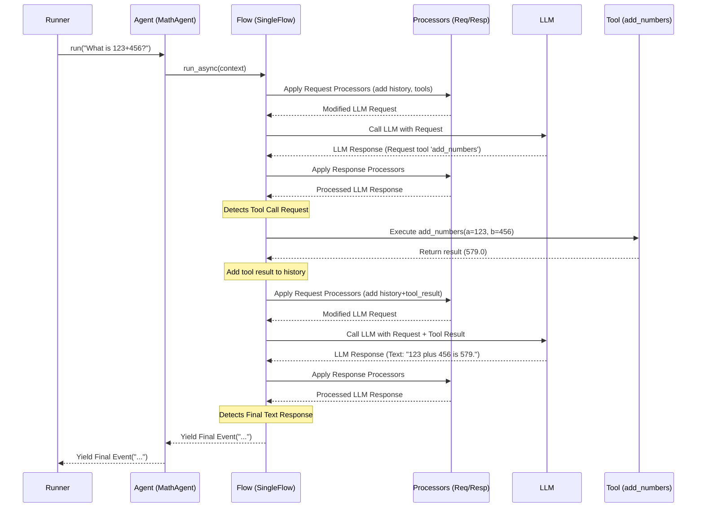

# Chapter 5: LLM Flow - Orchestrating the Agent's Thoughts

In [Chapter 4: Tool - Giving Agents Superpowers](04_tool.md), we saw how to give our [Agents](01_agent.md) special abilities using Tools, like our `calculator_tool`. We observed a sequence of events: the Agent received the user's question, decided to use the tool, got the result, and *then* formulated the final answer.

But what managed that sequence? How did the agent know to:
1.  Talk to the LLM?
2.  Recognize the LLM wanted to use a tool?
3.  Run the tool?
4.  Send the tool's result *back* to the LLM?
5.  Wait for the final answer?

This internal "dance" of steps needs coordination. This coordination is handled by the **LLM Flow**.

## Why Do We Need an LLM Flow?

Imagine you ask an assistant to write a short report on the weather in Paris. They might need to:
1.  **Think:** Understand the request ("weather report for Paris").
2.  **Act:** Use a weather tool to get the current conditions in Paris.
3.  **Think:** Receive the raw weather data (e.g., "22°C, sunny").
4.  **Act:** Write a user-friendly sentence based on that data ("The weather in Paris is currently sunny with a temperature of 22°C.").

This involves multiple steps, including interacting with a tool and reasoning about its output. A simple, single call to the LLM isn't always enough.

The **LLM Flow** is the component within an `LlmAgent` that defines this standard operating procedure. It's the internal logic loop that orchestrates the conversation turn, managing interactions with the LLM, handling tool calls, and ensuring all the steps happen in the right order to produce a final response.

Think of it as the agent's internal "checklist" or "workflow engine" for handling a single user request that might require multiple back-and-forth steps with the LLM or tools.

## Key Concepts

Let's break down the core ideas behind LLM Flows.

### 1. The Basic Loop: `SingleFlow`

Most `LlmAgent`s you create will use a default flow called `SingleFlow`. This flow handles the common scenario of:
*   Receiving input.
*   Calling the LLM.
*   Handling any requests from the LLM to use [Tools](04_tool.md).
*   Getting the final response from the LLM.

It manages the cycle we saw in the calculator example: `LLM Request -> Tool Call -> Tool Result -> LLM Final Response`.

### 2. Agent Handoffs: `AutoFlow`

Sometimes, one agent might realize that another agent is better suited for a task. Imagine a general `ReceptionistAgent` that receives a request like "Help me plan a trip to Hawaii". The `ReceptionistAgent` might decide to hand over the conversation to a specialized `TravelPlannerAgent`.

`AutoFlow` is a more advanced flow that inherits all the capabilities of `SingleFlow` but *also* adds the ability for the LLM to decide to transfer control to another agent within an agent hierarchy (parent/sub-agents or sibling agents). We won't dive deep into `AutoFlow` in this beginner chapter, but it's good to know it exists for building more complex, collaborative agent systems.

### 3. Customizing Steps: Processors

How does the Flow actually prepare the information *before* sending it to the LLM? And how does it process the LLM's response *after* receiving it? It uses **Processors**.

*   **`BaseLlmRequestProcessor`:** These run *before* the LLM is called. They can modify the request being sent to the LLM. For example, default processors automatically add the agent's `instruction`, the conversation history ([Session](03_session.md)), and the list of available [Tools](04_tool.md) to the LLM request.
*   **`BaseLlmResponseProcessor`:** These run *after* the LLM responds but *before* the Flow decides what to do next (like call a tool or finish). They can analyze or modify the LLM's response. For instance, a processor might look for specific patterns in the response or log certain information.

Think of processors like checkpoints or middleware stations along the Flow's path. They allow the ADK (and potentially advanced users) to inject specific logic into the request/response cycle without changing the core Flow loop itself.

You usually don't interact with processors directly when starting out, as the default Flows (`SingleFlow`, `AutoFlow`) come pre-configured with the necessary processors.

## How Flows are Used (Mostly Behind the Scenes!)

The good news for beginners is that you often don't need to explicitly choose or configure a Flow. When you create an `LlmAgent`, the ADK typically assigns a suitable default Flow (`SingleFlow` unless agent transfer features are specifically enabled).

```python
# Example from Chapter 4 (Flow is used implicitly!)
from google.adk.agents import LlmAgent
from google.adk.tools import FunctionTool

# Tool Definition
def add_numbers(a: float, b: float) -> float:
  """Adds two numbers."""
  print(f"--- Tool: Calculating {a} + {b} ---")
  return a + b

calculator_tool = FunctionTool(add_numbers)

# Agent Definition
math_agent = LlmAgent(
    name="MathAgent",
    instruction="Use tools to answer math questions.",
    model="gemini-1.5-flash",
    tools=[calculator_tool] 
    # No 'flow=' parameter needed here! 
    # ADK assigns a default Flow (likely SingleFlow)
)

# When runner.run(agent=math_agent, ...) is called, 
# the math_agent's internal Flow manages the interaction.
```

In this example, even though we didn't mention `SingleFlow`, it was working behind the scenes inside `math_agent`. When the [Runner](02_runner.md) called `math_agent.run_async(...)`, the agent delegated the complex task of managing the LLM call, tool execution, and result feedback loop to its internal `SingleFlow`.

## Under the Hood: The `SingleFlow` Loop

Let's peek at the simplified steps `SingleFlow` takes when managing an interaction like our calculator example:

1.  **Start:** The [Agent's](01_agent.md) `run_async` method is called by the [Runner](02_runner.md). The Agent passes control to its assigned `Flow` (e.g., `SingleFlow`).
2.  **Prepare LLM Request:**
    *   The Flow gathers context: conversation history ([Session](03_session.md)), user's latest message, agent's `instruction`.
    *   It runs all configured **Request Processors** (`BaseLlmRequestProcessor`). These processors add things like the formatted instructions, the history, and the definitions of available [Tools](04_tool.md) (like `calculator_tool`) to the request object (`LlmRequest`).
3.  **Call LLM:** The Flow sends the prepared `LlmRequest` to the specified LLM (e.g., Gemini).
4.  **Receive LLM Response:** The Flow gets the response (`LlmResponse`) from the LLM.
5.  **Process LLM Response:**
    *   The Flow runs all configured **Response Processors** (`BaseLlmResponseProcessor`) on the `LlmResponse`.
6.  **Analyze Response & Act:** The Flow examines the processed response:
    *   **Is it a Tool Call?** If the LLM responded with a request to use a tool (like `add_numbers(a=123, b=456)`):
        *   The Flow identifies the correct [Tool](04_tool.md) object.
        *   It executes the tool's `run_async` method with the arguments provided by the LLM.
        *   It packages the tool's result into a special message/event.
        *   It adds this tool result to the conversation history.
        *   **LOOP:** Go back to **Step 2** to call the LLM *again*, now providing the tool's result as context.
    *   **Is it a Final Text Response?** If the LLM responded with text meant for the user (like "123 plus 456 is 579."):
        *   The Flow packages this text into a final [Event](08_event.md).
        *   It yields this final event back to the Agent/Runner.
        *   **END:** The loop finishes for this turn.
    *   **Is it something else?** (e.g., an error, an intermediate thought process - handled by specific processors). The flow manages these cases according to its logic.

This loop continues until the LLM provides a final response intended for the user, or until a special condition (like an agent transfer in `AutoFlow`) occurs.

Here's a diagram illustrating this loop for the calculator example:



## Peeking Inside the Code

Let's look at the structure in the codebase.

**1. The Base Flow (`src/google/adk/flows/llm_flows/base_llm_flow.py`)**

This abstract class defines the core structure, including the `run_async` loop and placeholders for calling processors and the LLM.

```python
# Simplified from src/google/adk/flows/llm_flows/base_llm_flow.py
from abc import ABC
from typing import AsyncGenerator, TYPE_CHECKING
from ...events.event import Event
# Import Processors and other necessary types

if TYPE_CHECKING:
  from ...agents.invocation_context import InvocationContext
  from ._base_llm_processor import BaseLlmRequestProcessor, BaseLlmResponseProcessor
  from ...models.llm_request import LlmRequest
  from ...models.llm_response import LlmResponse

class BaseLlmFlow(ABC):
  def __init__(self):
    self.request_processors: list[BaseLlmRequestProcessor] = []
    self.response_processors: list[BaseLlmResponseProcessor] = []

  async def run_async(
      self, invocation_context: InvocationContext
  ) -> AsyncGenerator[Event, None]:
    # The main loop
    while True:
      last_event = None
      # Run one step (LLM call + tool handling)
      async for event in self._run_one_step_async(invocation_context):
        last_event = event
        yield event # Send events back up (tool calls, final response)
      # Break loop if the last event was final
      if not last_event or last_event.is_final_response():
        break

  async def _run_one_step_async(
      self, invocation_context: InvocationContext
  ) -> AsyncGenerator[Event, None]:
    llm_request = LlmRequest() # Create an empty request

    # === Preprocessing ===
    async for event in self._preprocess_async(invocation_context, llm_request):
        yield event # Yield any events from processors (rare)
    if invocation_context.end_invocation: return # Stop if needed

    # === Call LLM ===
    model_response_event = Event(...) # Prepare an event object
    async for llm_response in self._call_llm_async(
        invocation_context, llm_request, model_response_event
    ):
        # === Postprocessing ===
        async for event in self._postprocess_async(
            invocation_context, llm_request, llm_response, model_response_event
        ):
            yield event # Yield tool results or final response events

  # --- Helper methods (simplified) ---
  async def _preprocess_async(self, context, request):
      # Run all self.request_processors
      # Run tool.process_llm_request for all tools
      pass # yield events if any processor generates one

  async def _call_llm_async(self, context, request, event_obj):
      # Get the LLM model from the agent
      # Call llm.generate_content_async(request)
      # yield LlmResponse(s)
      pass

  async def _postprocess_async(self, context, request, response, event_obj):
      # Run all self.response_processors
      # Check if response is a tool call (function call)
      if response.get_function_calls():
          # Handle function calls (execute tool, generate result event)
          async for event in self._postprocess_handle_function_calls_async(...):
              yield event
      else:
          # Generate the final response event
          final_event = self._finalize_model_response_event(...)
          yield final_event
```

**2. The Processors (`src/google/adk/flows/llm_flows/_base_llm_processor.py`)**

These define the simple interface that processors must implement.

```python
# Simplified from src/google/adk/flows/llm_flows/_base_llm_processor.py
from abc import ABC, abstractmethod
from typing import AsyncGenerator, TYPE_CHECKING
# ... other imports ...

if TYPE_CHECKING:
    from ...agents.invocation_context import InvocationContext
    from ...events.event import Event
    from ...models.llm_request import LlmRequest
    from ...models.llm_response import LlmResponse

class BaseLlmRequestProcessor(ABC):
  @abstractmethod
  async def run_async(
      self, invocation_context: InvocationContext, llm_request: LlmRequest
  ) -> AsyncGenerator[Event, None]:
    """Modify the llm_request before sending to LLM."""
    raise NotImplementedError
    yield # Needed for async generator

class BaseLlmResponseProcessor(ABC):
  @abstractmethod
  async def run_async(
      self, invocation_context: InvocationContext, llm_response: LlmResponse
  ) -> AsyncGenerator[Event, None]:
    """Process the llm_response after receiving from LLM."""
    raise NotImplementedError
    yield # Needed for async generator
```

**3. `SingleFlow` Implementation (`src/google/adk/flows/llm_flows/single_flow.py`)**

This class inherits from `BaseLlmFlow` and populates the `request_processors` and `response_processors` lists with standard processors needed for basic agent behavior.

```python
# Simplified from src/google/adk/flows/llm_flows/single_flow.py
from .base_llm_flow import BaseLlmFlow
# Import various default processor modules (basic, instructions, contents, etc.)
from . import basic, instructions, contents, _code_execution, _nl_planning
from ...auth import auth_preprocessor

class SingleFlow(BaseLlmFlow):
  """SingleFlow handles tools calls for a single agent."""
  def __init__(self):
    super().__init__()
    # Add standard processors to handle setup and tool use
    self.request_processors += [
        basic.request_processor, # Basic setup
        auth_preprocessor.request_processor, # Auth handling
        instructions.request_processor, # Add agent instructions
        # identity.request_processor, # Add agent identity (if needed)
        contents.request_processor, # Add conversation history
        _nl_planning.request_processor, # Handle planning steps (advanced)
        _code_execution.request_processor, # Prepare code execution (advanced)
    ]
    self.response_processors += [
        _nl_planning.response_processor, # Process planning results
        _code_execution.response_processor, # Process code results
    ]
```
Here, `instructions.request_processor` is responsible for taking the agent's `instruction` string and adding it to the `LlmRequest`. Similarly, `contents.request_processor` adds the chat history from the [Session](03_session.md).

**4. `AutoFlow` Implementation (`src/google/adk/flows/llm_flows/auto_flow.py`)**

`AutoFlow` simply extends `SingleFlow` and adds one more request processor specifically for handling agent transfers.

```python
# Simplified from src/google/adk/flows/llm_flows/auto_flow.py
from .single_flow import SingleFlow
from . import agent_transfer # Import the agent transfer processor

class AutoFlow(SingleFlow):
  """AutoFlow is SingleFlow plus agent transfer capability."""
  def __init__(self):
    super().__init__()
    # Add the processor that enables agent transfer logic
    self.request_processors += [agent_transfer.request_processor]
```

## Conclusion

The **LLM Flow** is the engine heart of an `LlmAgent`, orchestrating the internal steps needed to handle a user's request. It manages the conversation loop, coordinates LLM interactions, handles tool execution via Function Calling, and optionally manages transfers to other agents (`AutoFlow`).

*   `SingleFlow` is the default, handling standard LLM calls and tool usage.
*   `AutoFlow` extends `SingleFlow` to allow agents to delegate tasks to other agents.
*   **Processors** (`BaseLlmRequestProcessor`, `BaseLlmResponseProcessor`) act as checkpoints within the flow, allowing modification of requests and responses.
*   For basic use, you don't need to manage Flows directly; the ADK assigns appropriate defaults.

Understanding the Flow helps clarify *how* an agent goes from receiving input to producing output, especially when intermediate steps like tool use are involved. It's the director ensuring all the actors (LLM, Tools, Processors) play their parts correctly.

Now that we understand the flow of control within an agent, let's zoom in on the actual communication between the Flow and the LLM.

**Next:** [Chapter 6: LLM Interaction - Talking to the Model](06_llm_interaction.md)

---

Generated by [AI Codebase Knowledge Builder](https://github.com/The-Pocket/Tutorial-Codebase-Knowledge)