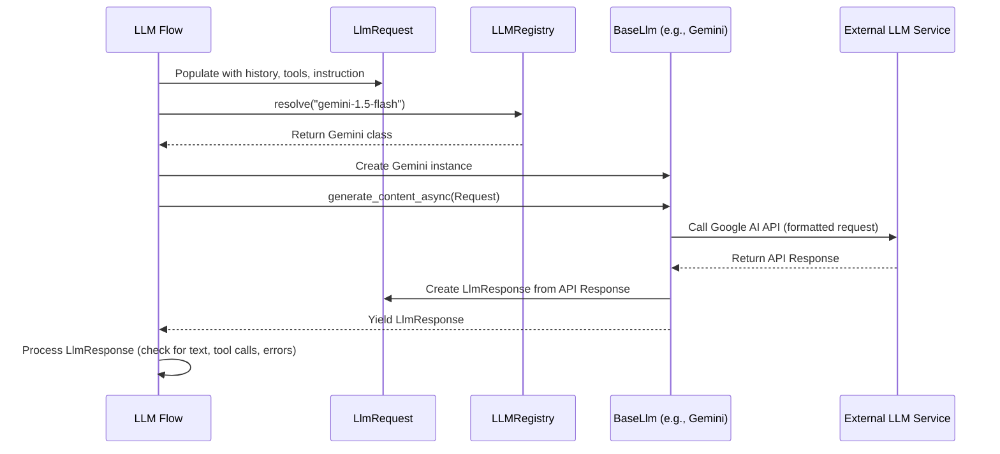

# Chapter 6: LLM Interaction - Talking to the Model

In [Chapter 5: LLM Flow](05_llm_flow.md), we learned how the `LlmAgent` orchestrates the steps needed to handle a user request, including deciding when to call a Large Language Model (LLM) and when to use a [Tool](04_tool.md). We saw the Flow as the internal "workflow engine".

But when the Flow decides it's time to actually *talk* to the LLM (like Gemini or Claude), how does that conversation happen? How does the ADK package up the instructions, history, and tool information? How does it send this package? And how does it understand the LLM's reply?

This chapter focuses on that specific communication step: the **LLM Interaction**.

## Use Case: Asking the Math Agent (Again!)

Remember our `MathAgent` from [Chapter 4](04_tool.md)? When we asked it "What is 123 plus 456?", the [LLM Flow](05_llm_flow.md) managed the process:

1.  Flow prepares to ask the LLM for the first time.
2.  **Flow talks to the LLM.** (This is the LLM Interaction step we're focusing on now).
3.  Flow receives the LLM's request to use the `add_numbers` tool.
4.  Flow runs the `add_numbers` tool.
5.  Flow prepares to ask the LLM *again*, this time including the tool result.
6.  **Flow talks to the LLM again.** (Another LLM Interaction).
7.  Flow receives the final text answer from the LLM.

Understanding LLM Interaction helps us see exactly *what* information is exchanged during steps 2 and 6.

## What Happens When the ADK Talks to an LLM?

Think of talking to an LLM like sending a very detailed request form to a specialized assistant and getting a reply back. The ADK needs a standard way to fill out this form and interpret the reply, regardless of whether the assistant is Gemini, Claude, or another model.

Here are the key pieces involved:

### 1. The Request Form: `LlmRequest`

Before contacting the LLM, the ADK (specifically, the [LLM Flow](05_llm_flow.md) using its Request Processors) gathers all the necessary information and puts it into a structured object called `LlmRequest`. This "request form" contains:

*   **`model`:** Which specific LLM to talk to (e.g., `"gemini-1.5-flash"`).
*   **`contents`:** The conversation history, including past user messages, agent replies, and tool results, formatted correctly from the [Session](03_session.md).
*   **`config`:** Configuration details, including:
    *   `system_instruction`: The main instructions for the [Agent](01_agent.md) (e.g., "You are a helpful assistant...").
    *   `tools`: Descriptions of the available [Tools](04_tool.md) (like our `calculator_tool`).
    *   Other settings like temperature (randomness) or safety settings.
*   **`tools_dict`:** An internal mapping of tool names to the actual Tool objects, so the ADK can execute them if requested.

```python
# Simplified structure from src/google/adk/models/llm_request.py
from pydantic import BaseModel, Field
from google.genai import types # For Content, GenerateContentConfig etc.
from typing import Optional, Dict
from google.adk.tools import BaseTool # The base class for tools

class LlmRequest(BaseModel):
  model: Optional[str] = None
  contents: list[types.Content] = Field(default_factory=list)
  config: Optional[types.GenerateContentConfig] = Field(
      default_factory=types.GenerateContentConfig
  )
  # Internal field to hold the actual tool objects
  tools_dict: Dict[str, BaseTool] = Field(default_factory=dict, exclude=True) 
  
  # Helper methods exist to add instructions, tools, etc.
  # def append_instructions(self, instructions: list[str]): ...
  # def append_tools(self, tools: list[BaseTool]): ...
```

Think of `LlmRequest` as the complete package of information the LLM needs to understand the current situation and what it's supposed to do.

### 2. The Universal Remote: `BaseLlm`

Different LLMs (Gemini, Claude, etc.) might have slightly different ways they like to be contacted (different APIs). The ADK needs a consistent way to interact with any of them.

`BaseLlm` is like a universal remote control. It defines the *standard buttons* (methods) that the ADK will use to talk to *any* LLM. The most important "button" is `generate_content_async`.

```python
# Simplified from src/google/adk/models/base_llm.py
from abc import abstractmethod
from typing import AsyncGenerator
from pydantic import BaseModel
from .llm_request import LlmRequest # The request form
from .llm_response import LlmResponse # The reply form

class BaseLlm(BaseModel):
  model: str # The specific model name (e.g., "gemini-1.5-flash")

  @classmethod
  def supported_models(cls) -> list[str]:
      # Returns list of model name patterns this class supports
      return []

  @abstractmethod
  async def generate_content_async(
      self, llm_request: LlmRequest, stream: bool = False
  ) -> AsyncGenerator[LlmResponse, None]:
      """
      Sends the request to the specific LLM and yields responses.
      
      For simple calls, it yields one LlmResponse.
      For streaming calls, it might yield multiple partial responses.
      """
      raise NotImplementedError
      yield # Required for async generator methods
```

Any class that wants to represent a specific LLM within the ADK must inherit from `BaseLlm` and implement the `generate_content_async` method.

### 3. The Specific Remotes: `Gemini`, `Claude`, `LiteLlm`

These are concrete implementations of `BaseLlm`. Each class knows how to talk to its specific type of model.

*   **`Gemini` (`src/google/adk/models/google_llm.py`):** Knows how to format the `LlmRequest` into the specific format required by the Google AI Gemini API and process the Gemini API's response back into an `LlmResponse`. It uses the `google.generativeai` Python library.
*   **`Claude` (`src/google/adk/models/anthropic_llm.py`):** Knows how to talk to Anthropic's Claude models (specifically via Vertex AI in this implementation). It uses the `anthropic` Python library.
*   **`LiteLlm` (`src/google/adk/models/lite_llm.py`):** A wrapper that uses the `litellm` library, allowing interaction with a wide variety of models (OpenAI, Azure, Cohere, etc.) through a unified interface.

When the [LLM Flow](05_llm_flow.md) needs to call the LLM specified in the `LlmRequest` (e.g., `"gemini-1.5-flash"`), it will use the corresponding `BaseLlm` implementation (in this case, an instance of the `Gemini` class).

Here's a highly simplified glimpse inside the `Gemini` class's implementation:

```python
# Highly simplified concept from src/google/adk/models/google_llm.py
from google.genai import Client # The official Google AI client library
from .base_llm import BaseLlm
from .llm_request import LlmRequest
from .llm_response import LlmResponse

class Gemini(BaseLlm):
  # ... (setup, supported_models, etc.)

  @property # Lazily create the client when first needed
  def api_client(self) -> Client:
      # Creates and returns an instance of the Google AI client
      # (Handles authentication implicitly based on environment)
      return Client(...) 

  async def generate_content_async(
      self, llm_request: LlmRequest, stream: bool = False
  ) -> AsyncGenerator[LlmResponse, None]:
      
      print(f"--- Gemini class: Sending request to model {llm_request.model} ---")
      # Use the Google AI client library to make the actual API call
      # Note: The real code handles streaming responses differently
      response = await self.api_client.aio.models.generate_content(
          model=llm_request.model,
          contents=llm_request.contents,
          config=llm_request.config,
          # tools are derived from llm_request.config and passed here
      )
      print(f"--- Gemini class: Received response from API ---")
      
      # Convert the raw API response into the standard ADK LlmResponse format
      adk_response = LlmResponse.create(response) 
      yield adk_response 
```

### 4. The Reply Form: `LlmResponse`

After the specific `BaseLlm` implementation (like `Gemini`) gets a reply from the actual LLM service, it translates that reply into a standard ADK format: the `LlmResponse` object. This "reply form" contains:

*   **`content`:** The main payload from the LLM. This usually contains:
    *   `parts`: A list of response parts. This could be:
        *   Text (`Part.text`): The actual text generated by the LLM.
        *   Function Call (`Part.function_call`): A request from the LLM to execute one of the available [Tools](04_tool.md). It includes the tool `name` and `args`.
*   **`error_code` / `error_message`:** If something went wrong (e.g., safety violation, invalid request), these fields will contain details.
*   **`partial`:** A flag used during streaming to indicate if the text is just a piece of a longer response.
*   **`grounding_metadata`:** Information about sources if the LLM used grounding (like web search results).

```python
# Simplified structure from src/google/adk/models/llm_response.py
from pydantic import BaseModel
from google.genai import types # For Content, GroundingMetadata
from typing import Optional

class LlmResponse(BaseModel):
  content: Optional[types.Content] = None # The main response data
  grounding_metadata: Optional[types.GroundingMetadata] = None
  partial: Optional[bool] = None # For streaming text
  turn_complete: Optional[bool] = None # For streaming (bidi)
  error_code: Optional[str] = None
  error_message: Optional[str] = None
  interrupted: Optional[bool] = None # For streaming (bidi)

  @staticmethod
  def create(
      generate_content_response: types.GenerateContentResponse,
  ) -> 'LlmResponse':
      # Logic to parse the raw API response (e.g., from Gemini)
      # and create a standard LlmResponse object.
      # It checks candidates, errors, etc.
      pass 
```

The [LLM Flow](05_llm_flow.md) receives this `LlmResponse` and uses it to decide the next step (e.g., run the requested tool, yield the final text to the user, or handle an error).

### 5. The Phonebook: `LLMRegistry`

How does the ADK know that when the `model` is `"gemini-1.5-flash"`, it should use the `Gemini` class, and when it's `"claude-3-opus..."`, it should use the `Claude` class?

This is where the `LLMRegistry` comes in. It acts like a phonebook or a directory. When the ADK needs to talk to a model, it asks the registry: "Which `BaseLlm` class should I use for this model name?"

*   The registry stores mappings between model name patterns (like `"gemini-.*"` or `"claude-3-.*"`) and the corresponding `BaseLlm` implementation class (`Gemini`, `Claude`).
*   Specific implementations (like `Gemini`) register themselves and the model patterns they support when the ADK starts up.
*   The registry provides a `resolve` method to find the right class and a `new_llm` method to create an instance of that class for a given model name.

```python
# Simplified concept from src/google/adk/models/registry.py
import re
from typing import Type
from .base_llm import BaseLlm

# Internal storage: { "model_name_regex": LLM_Class }
_llm_registry_dict: dict[str, Type[BaseLlm]] = {} 

class LLMRegistry:

  @staticmethod
  def register(llm_cls: Type[BaseLlm]):
      # Called by LLM classes (Gemini, Claude) during setup
      for regex_pattern in llm_cls.supported_models():
          print(f"--- Registry: Registering {llm_cls.__name__} for pattern '{regex_pattern}' ---")
          _llm_registry_dict[regex_pattern] = llm_cls

  @staticmethod
  def resolve(model: str) -> Type[BaseLlm]:
      # Finds the class that matches the model name
      print(f"--- Registry: Resolving model '{model}' ---")
      for regex_pattern, llm_class in _llm_registry_dict.items():
          if re.compile(regex_pattern).fullmatch(model):
              print(f"--- Registry: Found class {llm_class.__name__} ---")
              return llm_class
      raise ValueError(f"Model {model} not found in registry.")

  @staticmethod
  def new_llm(model: str) -> BaseLlm:
      # Finds the class AND creates an instance of it
      llm_class = LLMRegistry.resolve(model)
      return llm_class(model=model)

# --- Example of how Gemini registers itself (happens automatically at startup) ---
# from .google_llm import Gemini 
# LLMRegistry.register(Gemini) # Registers Gemini for patterns like "gemini-.*"
```

You usually don't interact with the `LLMRegistry` directly. The framework uses it behind the scenes to get the correct `BaseLlm` object when the Flow needs to make a call.

## How It All Fits Together: The Interaction Flow

Let's trace the path when the [LLM Flow](05_llm_flow.md) decides to call the LLM:

1.  **Flow Prepares:** The Flow runs its Request Processors, which populate an `LlmRequest` object with history, instructions, tool descriptions, etc., and sets the target `model` name (e.g., `"gemini-1.5-flash"`).
2.  **Flow Asks Registry:** The Flow asks the `LLMRegistry` for the correct `BaseLlm` instance for the requested model name. (`LLMRegistry.new_llm("gemini-1.5-flash")` returns a `Gemini` instance).
3.  **Flow Calls Model:** The Flow calls the `generate_content_async` method on the obtained `Gemini` instance, passing the prepared `LlmRequest`.
4.  **Model Implementation Acts:** The `Gemini.generate_content_async` method takes the `LlmRequest`, converts it into the format expected by the actual Google AI API, and makes the network call using the `google-generativeai` library.
5.  **External Service Responds:** The Google AI service processes the request and sends back a response.
6.  **Model Implementation Parses:** The `Gemini.generate_content_async` method receives the raw API response and parses it, creating a standardized `LlmResponse` object (handling potential errors, function calls, text content, etc.).
7.  **Model Implementation Returns:** The `Gemini.generate_content_async` method yields the `LlmResponse` back to the Flow.
8.  **Flow Processes:** The Flow receives the `LlmResponse` and runs its Response Processors. Based on the content of the `LlmResponse`, the Flow decides the next action (e.g., execute a tool, yield the response, loop back to call the LLM again).

Here's a simplified diagram:



## Conclusion

LLM Interaction is the crucial step where the ADK actually communicates with the underlying Large Language Model.

*   The **`LlmRequest`** object bundles all necessary information (history, instructions, tools) for the LLM.
*   **`BaseLlm`** provides a standard interface for interacting with any LLM.
*   Implementations like **`Gemini`**, **`Claude`**, and **`LiteLlm`** handle the specifics of talking to different model APIs.
*   The **`LlmResponse`** object standardizes the reply from the LLM, containing text, function call requests, or errors.
*   The **`LLMRegistry`** acts as a directory to find the correct `BaseLlm` implementation for a given model name.

This structured approach allows the ADK framework (especially the [LLM Flow](05_llm_flow.md)) to delegate the details of model communication, making it easier to support various LLMs and manage the interaction loop consistently.

Now that we understand how the agent thinks ([LLM Flow](05_llm_flow.md)) and how it talks to the LLM ([LLM Interaction](06_llm_interaction.md)), what context does it have available *while* it's executing? We need to understand the `InvocationContext`.

**Next:** [Chapter 7: Invocation Context](07_invocation_context.md)

---

Generated by [AI Codebase Knowledge Builder](https://github.com/The-Pocket/Tutorial-Codebase-Knowledge)