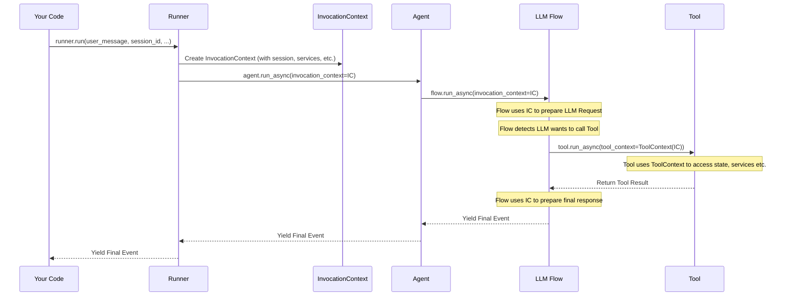

# Chapter 7: Invocation Context - The Agent's Briefing for a Single Turn

In the previous chapter, [Chapter 6: LLM Interaction](06_llm_interaction.md), we looked closely at how the Agent Development Kit (ADK) framework packages information and talks to the Large Language Model (LLM). We saw the request (`LlmRequest`) and response (`LlmResponse`) objects.

But when an [Agent](01_agent.md) is running its logic (maybe inside its [LLM Flow](05_llm_flow.md)) or when a [Tool](04_tool.md) is executing, how does it access all the necessary *runtime* information for that specific moment?

*   How does it know which [Session](03_session.md) (conversation history) it's working on?
*   How does it access services like file storage ([Artifact Service](10_artifact_service.md))?
*   How does it know which user message triggered this specific action?

All this vital, temporary information needs to be bundled together and passed around. This bundle is called the **Invocation Context**.

## Use Case: An Agent Needs Multiple Things at Once

Imagine you're building an agent that summarizes documents. A user might say, "Summarize the 'meeting_notes_v2.txt' file I uploaded earlier."

To handle this, the agent needs access to several things *during this single turn*:

1.  The user's request: "Summarize 'meeting_notes_v2.txt'".
2.  The current conversation history ([Session](03_session.md)) to understand the context (maybe the user specified the summary length in a previous message).
3.  Access to the file storage service ([Artifact Service](10_artifact_service.md)) to *load* the `meeting_notes_v2.txt` file.
4.  Information about itself (e.g., its name, its instructions).

How can the agent reliably get all this information in one place while it's working on *this specific request*?

## The Briefing Document: What is Invocation Context?

Think of the **Invocation Context** as the temporary "briefing document" or "workspace" created for a *single agent invocation* – meaning, for one complete processing cycle triggered by a user message (one turn of the conversation).

**Analogy:** Imagine a chef ([Agent](01_agent.md)) in a busy kitchen. When a new order comes in (user message), the manager ([Runner](02_runner.md)) gives the chef a specific order ticket (the **Invocation Context**). This ticket doesn't just have the main dish order ("Summarize meeting_notes_v2.txt"), it also includes:

*   The table number (Session ID).
*   Any special requests from the customer mentioned earlier (Session History).
*   The customer's name (User ID).
*   A key to the pantry (access to Artifact Service).
*   A note about which kitchen station (Agent) is assigned.
*   Maybe a specific time limit for this order (Run Config).

The `InvocationContext` holds all this runtime data together for that one specific job.

## What's Inside the Invocation Context?

The `InvocationContext` object bundles references to many important pieces of information. Here are some key fields (you can see the structure in `src/google/adk/agents/invocation_context.py`):

*   `session`: The complete [Session](03_session.md) object for the current conversation, including history (`events`) and temporary memory (`state`).
*   `agent`: The specific [Agent](01_agent.md) instance that is currently executing. This is important in hierarchies where one agent might call another.
*   `user_content`: The specific user message (`types.Content`) that triggered this current invocation turn.
*   `session_service`: The service responsible for managing [Sessions](03_session.md).
*   `artifact_service`: The service used for loading and saving files ([Artifact Service](10_artifact_service.md)).
*   `memory_service`: The service for long-term memory retrieval (not covered in detail yet).
*   `invocation_id`: A unique ID assigned to this specific invocation turn.
*   `run_config`: Any special configuration settings applied just for this run (e.g., maximum number of LLM calls).
*   `end_invocation`: A flag (defaults to `False`) that can be set to `True` (e.g., by a tool or callback) to signal that processing for this turn should stop immediately.

Let's look at a simplified view of the class definition:

```python
# Simplified structure from src/google/adk/agents/invocation_context.py

from google.genai import types
from pydantic import BaseModel
from ..sessions.session import Session
from .base_agent import BaseAgent
from ..artifacts.base_artifact_service import BaseArtifactService
# ... other imports ...

class InvocationContext(BaseModel):
  # --- Services ---
  artifact_service: Optional[BaseArtifactService] = None
  session_service: BaseSessionService
  memory_service: Optional[BaseMemoryService] = None

  # --- Runtime Info ---
  invocation_id: str      # Unique ID for this turn
  agent: BaseAgent        # The currently running agent
  user_content: Optional[types.Content] = None # Triggering user message
  session: Session        # The full conversation session

  # --- Control & Config ---
  end_invocation: bool = False # Flag to stop processing
  run_config: Optional[RunConfig] = None # Runtime settings

  # ... other fields for advanced features (branching, live queue, etc.)
  # ... helper properties like app_name, user_id derived from session
  # ... methods like increment_llm_call_count

  class Config:
      arbitrary_types_allowed = True # Allows non-pydantic types like BaseAgent
```

This context object acts as a central hub, providing access to everything needed during the execution of a single conversational turn.

## How Does the Invocation Context Flow?

You usually **don't create or manage `InvocationContext` directly** as a beginner developer. The ADK framework handles it for you. Here's the typical flow:

1.  **Runner Creates:** When you call `runner.run(...)` (as seen in [Chapter 2: Runner](02_runner.md)), the Runner gathers all the necessary information (finds the session, gets the user message, identifies the root agent, accesses configured services) and packages it into a *new* `InvocationContext` object for this specific turn.
2.  **Passed to Agent:** The Runner then calls the main agent's `run_async` method, passing this `InvocationContext` as the primary argument.
3.  **Passed Down (Hierarchy):** If the current agent decides to delegate work to a sub-agent, it typically passes the *same* `InvocationContext` down to the sub-agent's `run_async` method. This ensures the sub-agent has access to the same session, services, and overall context.
4.  **Passed to Flow:** The agent's `run_async` method usually hands off control to its configured [LLM Flow](05_llm_flow.md) (like `SingleFlow`), passing the `InvocationContext` along.
5.  **Used by Flow/Processors:** The Flow and its internal Request/Response Processors use the `InvocationContext` extensively. For example:
    *   Request processors read the `session.events` to build the history for the [LLM Interaction](06_llm_interaction.md).
    *   Request processors read `agent.instruction` and `agent.tools`.
    *   The Flow reads `run_config` to check limits (like max LLM calls).
6.  **Specialized Views for Tools/Callbacks:** When the Flow needs to execute a [Tool](04_tool.md), it doesn't pass the raw `InvocationContext`. Instead, it creates a specialized wrapper called `ToolContext`. Similarly, for other callbacks, a `CallbackContext` might be used. These contexts provide a *safer, more focused view* of the underlying `InvocationContext`, often adding specific features relevant to the tool or callback (like methods to easily save artifacts or update session state safely).

Here's a diagram showing the basic flow:



## Specialized Contexts: `ToolContext` and `CallbackContext`

While `InvocationContext` holds *everything*, components like Tools or internal callbacks often don't need access to *all* of it, and giving them full access could be risky (e.g., accidentally changing the wrong agent reference).

The ADK uses wrapper contexts like `ToolContext` and `CallbackContext` to provide a more tailored and safer interface.

*   **`ReadonlyContext` (`src/google/adk/agents/readonly_context.py`):** A base class providing read-only access to basic info like `invocation_id`, `agent_name`, and `session.state`.

    ```python
    # Simplified from src/google/adk/agents/readonly_context.py
    class ReadonlyContext:
        def __init__(self, invocation_context: InvocationContext):
            self._invocation_context = invocation_context

        @property
        def invocation_id(self) -> str: return self._invocation_context.invocation_id
        # ... other readonly properties ...
    ```

*   **`CallbackContext` (`src/google/adk/agents/callback_context.py`):** Inherits from `ReadonlyContext` and adds features needed during various internal callbacks, most notably:
    *   **Mutable State:** Provides a `state` property that allows safe modification of the *session state* (changes are tracked as deltas).
    *   **Artifact Access:** Provides `load_artifact` and `save_artifact` methods that automatically use the `artifact_service` from the underlying `InvocationContext`.

    ```python
    # Simplified from src/google/adk/agents/callback_context.py
    from .readonly_context import ReadonlyContext
    from ..sessions.state import State # Special state wrapper

    class CallbackContext(ReadonlyContext):
        def __init__(self, invocation_context: InvocationContext, ...):
            super().__init__(invocation_context)
            # Wraps state for safe modification tracking
            self._state = State(invocation_context.session.state, ...)

        @property
        def state(self) -> State: return self._state # Allows ctx.state['foo'] = 'bar'

        def load_artifact(self, filename: str): # Uses IC's artifact_service
           return self._invocation_context.artifact_service.load_artifact(...)

        def save_artifact(self, filename: str, artifact): # Uses IC's service
           version = self._invocation_context.artifact_service.save_artifact(...)
           # Also records the change to be included in the event
           # ...
           return version
    ```

*   **`ToolContext` (`src/google/adk/tools/tool_context.py`):** Inherits from `CallbackContext`, making all its features available to Tools. It might add further tool-specific functionalities (like helpers for authentication needed by the tool). When you define a [Tool](04_tool.md), its `run_async` method often receives a `ToolContext` argument, giving it safe access to session state, artifacts, memory search, etc.

    ```python
    # Simplified from src/google/adk/tools/tool_context.py
    from ..agents.callback_context import CallbackContext
    # ... auth imports ...

    class ToolContext(CallbackContext):
        def __init__(self, invocation_context: InvocationContext, ...):
            super().__init__(invocation_context, ...)
            # ... maybe store function_call_id or other tool-specific things

        # Inherits state, load_artifact, save_artifact from CallbackContext
        # Adds tool-specific methods like:
        def list_artifacts(self) -> list[str]: # Uses IC's artifact_service
             return self._invocation_context.artifact_service.list_artifact_keys(...)

        def search_memory(self, query: str): # Uses IC's memory_service
             return self._invocation_context.memory_service.search_memory(...)

        # ... methods for handling tool-specific authentication ...
    ```

So, while `InvocationContext` is the master bundle created by the Runner, the parts of the system you interact with more directly (like Tools) usually receive the more convenient and safer `ToolContext` or `CallbackContext`.

## Conclusion

The **Invocation Context** is a fundamental, albeit mostly internal, concept in the ADK. It serves as the central carrier for all runtime data needed during a single turn of conversation processing.

*   It's created by the [Runner](02_runner.md) for each user request.
*   It holds references to the current [Agent](01_agent.md), [Session](03_session.md), user message, configuration, and services.
*   It's passed down through the agent hierarchy and used extensively by the [LLM Flow](05_llm_flow.md).
*   Components like [Tools](04_tool.md) interact with it indirectly via specialized contexts like `ToolContext` or `CallbackContext`.

Understanding the `InvocationContext` helps you see how all the different pieces of the ADK (Runner, Agent, Session, Services) are connected during the execution of a single turn.

Now that we understand the data flowing *into* and *during* an invocation, what about the results *coming out*? How does the agent communicate back its findings, actions, and final response? That's where Events come in.

**Next:** [Chapter 8: Event - Communicating Agent Actions](08_event.md)

---

Generated by [AI Codebase Knowledge Builder](https://github.com/The-Pocket/Tutorial-Codebase-Knowledge)