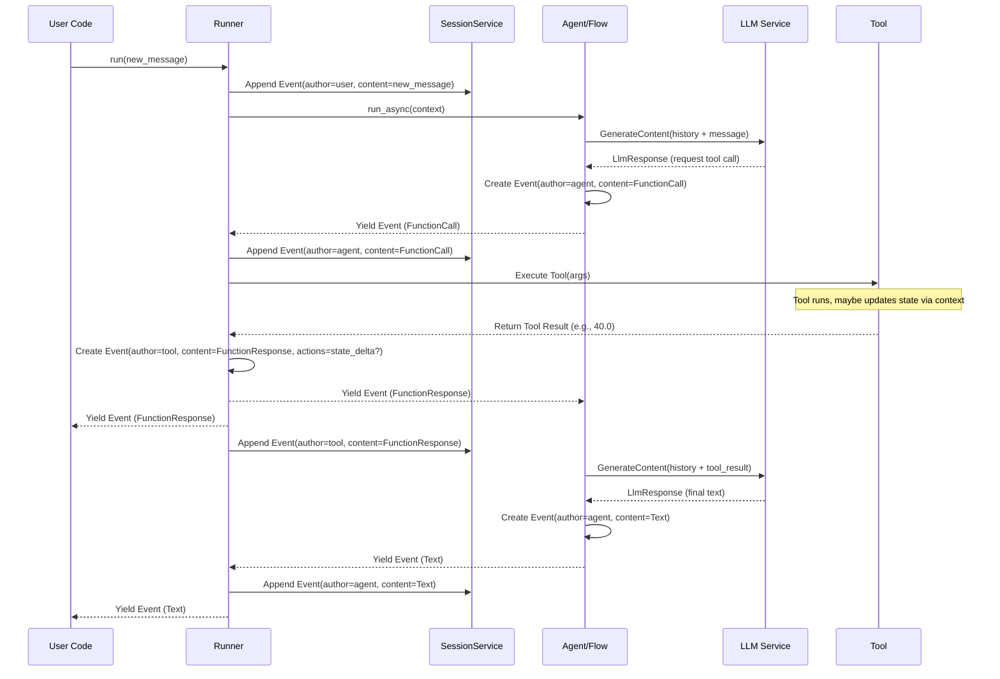

# Chapter 8: Event - Recording the Conversation Turn-by-Turn

In [Chapter 7: Invocation Context](07_invocation_context.md), we saw how the `InvocationContext` acts as a temporary "briefing document" holding all the information needed for a single turn of processing. It contains the [Session](03_session.md) history, access to services, and the current user message.

But once the [Agent](01_agent.md) or a [Tool](04_tool.md) processes this information and takes an action (like generating text, calling a tool, or updating the session's memory), how is that action recorded? How do we build the step-by-step log of the conversation that gets stored in the [Session](03_session.md)?

This is where the **Event** comes in.

## Use Case: Following the Chat Bubbles

Think about any chat application. The conversation history isn't just one big block of text; it's a series of individual messages or actions:

*   **You:** "Hi there!" (Bubble 1)
*   **Chatbot:** "Hello! How can I help you today?" (Bubble 2)
*   **You:** "What's 5 + 7?" (Bubble 3)
*   **Chatbot (Thinking):** *Decides to use a calculator tool.* (Internal Action)
*   **Chatbot (Using Tool):** *Calls calculator with 5 and 7.* (Action Bubble 4)
*   **Calculator Tool:** *Returns 12.* (Result Bubble 5)
*   **Chatbot:** "5 + 7 is 12." (Bubble 6)

Each of these bubbles or actions represents a distinct step in the interaction. To accurately track the conversation and provide the right context for future turns, the ADK needs a way to represent each of these steps individually.

## What is an Event?

An **Event** in the ADK is the fundamental unit that represents a single turn, message, or action within a conversation [Session](03_session.md). Think of it as a single **chat bubble** or a single entry in the detailed log of the interaction.

Each Event captures several key pieces of information:

1.  **`author`**: Who created this event?
    *   `"user"`: The message came directly from the end-user.
    *   *Agent Name* (e.g., `"Greeter"`, `"MathAgent"`): The event was generated by a specific [Agent](01_agent.md). This could be a text response or a request to use a tool.
    *   `"tool"`: The event represents the *result* returned by executing a [Tool](04_tool.md).
    *   `"code_executor"`: The event represents the result from the [Code Executor](09_code_executor.md) tool.

2.  **`content`**: What is the actual content of this event? This is usually stored using the `google.genai.types.Content` structure (which we also saw in [LLM Interaction](06_llm_interaction.md)), containing `parts`. A part could be:
    *   `Part(text="...")`: Simple text content.
    *   `Part(function_call=FunctionCall(name="...", args={...}))`: A request by an agent's LLM to call a specific tool with certain arguments.
    *   `Part(function_response=FunctionResponse(name="...", response={...}))`: The result returned by a tool after it was executed.
    *   `Part(code_execution_result=...)`: The output from running code via the Code Executor.

3.  **`actions`**: Did this event trigger any side effects beyond the main content? This is stored in an `EventActions` object and can include:
    *   `state_delta`: Changes to the [Session](03_session.md)'s `state` (the temporary notepad).
    *   `artifact_delta`: Records of files being saved via the [Artifact Service](10_artifact_service.md).
    *   `transfer_to_agent`: A request to hand off control to a different agent.
    *   `requested_auth_configs`: Information related to authentication needed by a tool (see [Authentication](11_authentication.md)).

4.  **`id`**: A unique identifier for this specific event.
5.  **`timestamp`**: When the event occurred.
6.  **`invocation_id`**: Which specific processing turn (from the [Invocation Context](07_invocation_context.md)) generated this event.

Essentially, an Event object bundles the "who, what, and when" for every step in the conversation, plus any associated actions. The list of these Events stored in the [Session](03_session.md) *is* the conversation history.

## Observing Events in Action

Let's revisit the `MathAgent` example from [Chapter 4: Tool](04_tool.md) and look more closely at the `Event` objects generated by the [Runner](02_runner.md).

```python
# --- Assuming setup from Chapter 4 ---
# Includes: imports for LlmAgent, FunctionTool, InMemoryRunner, Content, Part
# Includes: VertexAIProvider.configure(), add_numbers function, calculator_tool
# Includes: math_agent = LlmAgent(...) with calculator_tool

# Runner setup
runner = InMemoryRunner(agent=math_agent)
user_id = "user_event_test"
session_id = "conversation_events"

# User message
user_message = types.Content(
    role="user", parts=[types.Part(text="What is 5 times 8?")]
)

print(f"--- Running agent for user '{user_id}' ---")

# Run and observe the Events
event_stream = runner.run(
    user_id=user_id, session_id=session_id, new_message=user_message
)

for event in event_stream:
    print(f"\n--- Received Event ---")
    print(f"  ID: {event.id}")
    print(f"  Timestamp: {event.timestamp}")
    print(f"  Author: {event.author}")
    
    # Display Content
    if event.content and event.content.parts:
        part = event.content.parts[0] # Get the first part
        if part.text:
            print(f"  Content Type: Text")
            print(f"  Content Text: '{part.text}'")
        elif part.function_call:
            fc = part.function_call
            print(f"  Content Type: Function Call")
            print(f"  Tool Name: '{fc.name}'")
            print(f"  Tool Args: {fc.args}")
        elif part.function_response:
            fr = part.function_response
            print(f"  Content Type: Function Response")
            print(f"  Tool Name: '{fr.name}'")
            print(f"  Tool Output: {fr.response}")
        else:
            print(f"  Content Type: Other")
            
    # Display Actions (if any)
    if event.actions and event.actions.model_dump(exclude_defaults=True):
         print(f"  Actions: {event.actions.model_dump(exclude_defaults=True)}")

print("\n--- Agent finished ---")

```

**Example Output (simplified, details like IDs/timestamps will vary):**

```
--- Running agent for user 'user_event_test' ---

--- Received Event ---
  ID: aBcDeFgH
  Timestamp: 1700000001.123
  Author: MathAgent
  Content Type: Function Call
  Tool Name: 'multiply_numbers'  # Assuming we used a multiply tool
  Tool Args: {'a': 5.0, 'b': 8.0}

--- Received Event ---
  ID: iJkLmNoP
  Timestamp: 1700000002.456
  Author: tool                  # Event generated *after* the tool ran
  Content Type: Function Response
  Tool Name: 'multiply_numbers'
  Tool Output: {'result': 40.0}

--- Received Event ---
  ID: qRsTuVwX
  Timestamp: 1700000003.789
  Author: MathAgent
  Content Type: Text
  Content Text: '5 times 8 is 40.'

--- Agent finished ---
```

Notice how the `runner.run` method yields distinct `Event` objects for each significant step:

1.  **Agent requests tool:** An `Event` from `MathAgent` with `content` containing a `FunctionCall`.
2.  **Tool provides result:** An `Event` from `tool` with `content` containing a `FunctionResponse`. (Our `add_numbers` function from Chapter 4 would produce a similar event).
3.  **Agent gives final answer:** An `Event` from `MathAgent` with `content` containing the final `Text`.

Each of these Events is also appended to the [Session](03_session.md)'s history by the framework, providing the necessary context for the *next* turn. If there were state changes (e.g., `ctx.state['last_result'] = 40`), those would appear in the `actions.state_delta` field of the relevant event.

## How Events are Created and Used

You generally don't create `Event` objects manually. The ADK framework handles their creation at different stages:

1.  **User Input:** When you provide `new_message` to `runner.run()`, the [Runner](02_runner.md) wraps this `Content` into an `Event` with `author="user"` and appends it to the [Session](03_session.md) history via the `SessionService`.
2.  **Agent LLM Output:** When the agent's [LLM Flow](05_llm_flow.md) receives a response (`LlmResponse`) from the [LLM Interaction](06_llm_interaction.md) layer, it converts this `LlmResponse` into an `Event` object.
    *   The `author` is set to the agent's name.
    *   The `content` (text, function call) comes from the `LlmResponse`.
    *   Any pending `actions` (like state changes triggered by processors) are attached.
    *   This Event is yielded back to the Runner.
3.  **Tool Execution Result:** After a [Tool](04_tool.md) is executed (because the LLM requested it in a previous Event), the framework takes the tool's Python return value.
    *   It formats this result into a `FunctionResponse` part.
    *   It creates a new `Event` with `author="tool"`.
    *   Any `actions` performed by the tool (like state changes via `tool_context.state` or artifact saves via `tool_context.save_artifact`) are captured in the `EventActions`.
    *   This Event is yielded back to the Runner *and* sent back to the LLM Flow (which usually sends it back to the LLM in the next turn for processing).
4.  **Saving History:** The [Runner](02_runner.md) receives the events yielded by the agent/flow. For non-partial events (complete thoughts or actions), it calls `session_service.append_event(session=..., event=...)` to permanently store the event in the conversation's history within the [Session](03_session.md).

Here's a simplified diagram showing the creation and flow of events for a turn involving a tool:



## Peeking Inside the Code

Let's look at the simplified structure of the `Event` and `EventActions` classes.

**1. `Event` Class (`src/google/adk/events/event.py`)**

The `Event` class inherits from `LlmResponse` (from [Chapter 6](06_llm_interaction.md)), meaning it has fields like `content`, `error_code`, etc. It adds specific fields for tracking within the conversation history.

```python
# Simplified from src/google/adk/events/event.py
from datetime import datetime
import random
import string
from typing import Optional

from google.genai import types # Content, FunctionCall, etc.
from pydantic import Field
from ..models.llm_response import LlmResponse # Event inherits from LlmResponse
from .event_actions import EventActions # Import the Actions class

class Event(LlmResponse):
  """Represents a single step/message in a conversation."""

  # === Core Event Fields ===
  author: str 
  """'user' or the name of the agent/tool."""
  
  actions: EventActions = Field(default_factory=EventActions)
  """Actions taken alongside the content (state changes, etc.)."""

  invocation_id: str = '' # ID of the turn that generated this
  """The invocation ID of the event."""

  # === Metadata ===
  id: str = '' 
  """Unique identifier for this specific event."""
  
  timestamp: float = Field(default_factory=lambda: datetime.now().timestamp())
  """When the event was created."""
  
  # ... other fields like partial, long_running_tool_ids, branch ...
  
  def model_post_init(self, __context):
    """Generate a unique ID if one wasn't provided."""
    if not self.id:
      self.id = Event.new_id() # Generate a random 8-char ID

  # Helper methods to easily access parts of the content
  def get_function_calls(self) -> list[types.FunctionCall]:
      # ... logic to find FunctionCall parts in self.content ...
      pass

  def get_function_responses(self) -> list[types.FunctionResponse]:
      # ... logic to find FunctionResponse parts in self.content ...
      pass
      
  def is_final_response(self) -> bool:
      # ... logic to determine if this event is the final answer for a turn ...
      pass

  @staticmethod
  def new_id():
      # Generate a short random string ID
      chars = string.ascii_letters + string.digits
      return ''.join(random.choice(chars) for _ in range(8))
```

**2. `EventActions` Class (`src/google/adk/events/event_actions.py`)**

This class specifically holds the "side effects" associated with an Event.

```python
# Simplified from src/google/adk/events/event_actions.py
from typing import Optional
from pydantic import BaseModel, Field
# from ..auth.auth_tool import AuthConfig # For authentication

class EventActions(BaseModel):
  """Represents actions attached to an event."""

  state_delta: dict[str, object] = Field(default_factory=dict)
  """Changes made to the session state (key-value pairs)."""

  artifact_delta: dict[str, int] = Field(default_factory=dict)
  """Artifacts saved (filename -> version)."""

  transfer_to_agent: Optional[str] = None
  """Name of the agent to transfer control to."""

  escalate: Optional[bool] = None
  """Flag indicating escalation to a parent agent."""
  
  # requested_auth_configs: dict[str, AuthConfig] = Field(default_factory=dict)
  """Authentication configurations requested by a tool."""

  # skip_summarization: Optional[bool] = None
  """Hint for function response processing."""
```

An instance of `EventActions` is stored within the `actions` field of the `Event` object.

## Conclusion

The **Event** is the fundamental building block for recording conversation history and agent actions in the ADK.

*   Each Event represents a single step: a user message, an agent response (text or tool call), or a tool result.
*   It captures the `author`, `content`, `actions` (like state changes), `id`, and `timestamp`.
*   Events are generated by the ADK framework ([Runner](02_runner.md), [LLM Flow](05_llm_flow.md)) during the processing of a conversational turn.
*   The sequence of Events stored in the [Session](03_session.md) provides the complete context for the ongoing conversation.
*   You observe these events when iterating through the results of `runner.run()`.

Understanding Events helps you see how the ADK meticulously tracks every part of the interaction, enabling stateful and multi-step agent behavior.

So far, our tools have been simple Python functions. What if an agent needs to generate and *run* code dynamically? For that, the ADK provides a specialized tool.

**Next:** [Chapter 9: Code Executor - Running Code Safely](09_code_executor.md)

---

Generated by [AI Codebase Knowledge Builder](https://github.com/The-Pocket/Tutorial-Codebase-Knowledge)