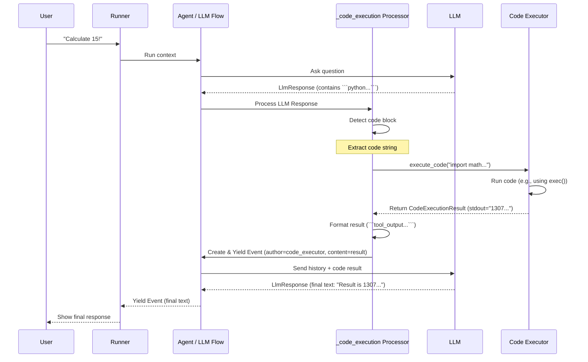

# Chapter 9: Code Executor - Running Code Safely

In [Chapter 8: Event - Recording the Conversation Turn-by-Turn](08_event.md), we saw how every step of an agent's interaction is recorded as an `Event`, building up the conversation history stored in the [Session](03_session.md). These events can represent text messages, requests to use [Tools](04_tool.md), or the results from those tools.

But what if the agent needs to perform a task that isn't covered by a pre-defined [Tool](04_tool.md)? What if the best way to answer a user's question involves running some calculation, manipulating data using a library like `pandas`, or visualizing data using `matplotlib`?

Sometimes, the Large Language Model (LLM) itself is smart enough to *write the code* needed to solve the problem. But how can our [Agent](01_agent.md) actually *run* that code?

This is where the **Code Executor** comes in.

## Use Case: The Advanced Calculator / Data Analyst

Imagine asking your agent:

*   "Calculate the 50th Fibonacci number." (Requires a loop or recursion, maybe tricky for an LLM alone).
*   "I have a CSV file with sales data. Can you calculate the average sales per region?" (Requires reading a file and using a data analysis library).
*   "Plot a sine wave using Python." (Requires a plotting library).

For these tasks, the LLM might generate Python code snippets. The Code Executor provides a way for the agent to take that generated code and run it, getting back the result (like the calculated number, the average sales figure, or the image of the plot).

## What is a Code Executor?

Think of the Code Executor as a special kind of [Tool](04_tool.md) that the agent can use, but instead of having a fixed function (like adding two numbers), its job is to **run arbitrary code snippets** provided by the LLM.

It acts like:

*   A **secure sandbox:** A safe, isolated environment where code can run without interfering with the main application or the underlying system (ideally!).
*   An **interpreter:** Like a Python interpreter that can execute commands it receives.

When the LLM decides it needs to run code, it will output the code block. The ADK framework detects this, sends the code to the configured Code Executor, runs it, captures the output (text printed to the console, errors, or even generated files like images), and sends that output back to the LLM so it can formulate a final response.

## Key Concepts: Different Ways to Execute Code

Executing code generated by an external source (like an LLM) can be risky if not done carefully. The ADK offers different Code Executor implementations (`BaseCodeExecutor` is the foundation), each providing a different environment with varying levels of safety and capability:

1.  **`BaseCodeExecutor` (`src/google/adk/code_executors/base_code_executor.py`)**
    *   This is the blueprint (an abstract base class) that all code executors follow. It defines the basic methods and configuration options.
    *   Key config options:
        *   `stateful`: Can the executor remember variables and state between different code executions within the same session? (Default: `False`).
        *   `error_retry_attempts`: How many times should the LLM be asked to fix the code if it produces an error? (Default: `2`).
        *   `code_block_delimiters`: How does the framework identify code blocks in the LLM's output? (e.g., `('```python\n', '\n```')`).
        *   `execution_result_delimiters`: How should the results of the code execution be formatted when sent back to the LLM? (e.g., `('```tool_output\n', '\n```')`).

2.  **`VertexAiCodeExecutor` (`src/google/adk/code_executors/vertex_ai_code_executor.py`)**
    *   **What it is:** Uses Google Cloud's **Vertex AI Code Interpreter** service. This runs the code in a managed, secure sandbox environment in the cloud.
    *   **Pros:** Secure, scalable, comes pre-installed with many common Python libraries (`pandas`, `numpy`, `matplotlib`, etc.), can handle state between executions (`stateful=True` is supported).
    *   **Cons:** Requires a Google Cloud project and might incur costs.
    *   **Best for:** Production applications or when you need common data science libraries without managing the environment yourself.

3.  **`UnsafeLocalCodeExecutor` (`src/google/adk/code_executors/unsafe_local_code_executor.py`)**
    *   **What it is:** Executes the Python code directly on the same machine where your ADK application is running, using Python's built-in `exec()` function.
    *   **Pros:** Simple to set up, no cloud dependencies, fast for local testing.
    *   **Cons:** **HIGHLY UNSAFE!** The code generated by the LLM runs with the *same permissions* as your main application. It could potentially read/write local files, access your network, install packages, or perform malicious actions. It's also not `stateful`.
    *   **Best for:** Quick local experiments **ONLY** where you fully trust the environment and understand the risks. **Never use this in production or with untrusted code/LLMs.**

4.  **`ContainerCodeExecutor` (`src/google/adk/code_executors/container_code_executor.py`)**
    *   **What it is:** Runs the code inside a Docker container. You can specify a pre-built image or provide your own Dockerfile.
    *   **Pros:** More isolated and secure than `UnsafeLocalCodeExecutor`, allows custom environments.
    *   **Cons:** Requires Docker to be installed and running, more setup than `UnsafeLocalCodeExecutor`, not `stateful`.
    *   **Best for:** Situations where you need a custom environment or better isolation than local execution, but don't want to use a cloud service.

For beginners, `VertexAiCodeExecutor` (if you have Cloud access) or `UnsafeLocalCodeExecutor` (for *very careful* local testing) are the easiest to start with. We'll use `UnsafeLocalCodeExecutor` in our example for simplicity, **but remember the safety warning!**

## How to Use It: Giving Your Agent Code Execution Powers

Let's create an agent that can calculate factorials using Python code generated by the LLM.

**Step 1: Import and Instantiate a Code Executor**

We'll use the `UnsafeLocalCodeExecutor`.

```python
# WARNING: UnsafeLocalCodeExecutor runs code directly on your machine.
# Understand the risks before using it.
from google.adk.code_executors import UnsafeLocalCodeExecutor

# Create an instance of the code executor
local_executor = UnsafeLocalCodeExecutor() 

print("Created UnsafeLocalCodeExecutor.") 
```

*   We import the executor class.
*   We create an instance. For this executor, no special configuration is needed for a basic setup.

**Step 2: Attach the Executor to an Agent**

We add the `code_executor` parameter when creating our `LlmAgent`.

```python
# --- Assuming previous setup: imports for LlmAgent, Runner, VertexAIProvider, etc. ---
# from google.adk.agents import LlmAgent
# ... other imports

# Configure model access (as in previous chapters)
# VertexAIProvider.configure() 

code_agent = LlmAgent(
    name="CodeRunnerAgent",
    description="An agent that can run Python code to perform tasks.",
    instruction=(
        "You are a helpful assistant. If asked to perform a calculation "
        "or task that requires code, generate a Python code block "
        "(using ```python ... ```) to do it. "
        "I will execute the code and give you the result."
    ),
    model="gemini-1.5-flash", 
    # Attach the executor here!
    code_executor=local_executor 
)

print(f"Created Agent: {code_agent.name} with a code executor.")
```

*   We define an `LlmAgent`.
*   The key addition is `code_executor=local_executor`. This tells the agent's internal [LLM Flow](05_llm_flow.md) to use our `local_executor` instance whenever it detects a code block in the LLM's response.

**Step 3: Run the Agent**

Now let's ask the agent a question that requires code execution.

```python
# --- Runner setup (as in Chapter 2) ---
# from google.adk.runners import InMemoryRunner
# from google.genai import types

runner = InMemoryRunner(agent=code_agent)
user_id = "user_code_exec"
session_id = "conversation_code"

# Ask a question likely to trigger code execution
user_message = types.Content(
    role="user", parts=[types.Part(text="What is 15 factorial?")]
)
print(f"User asks: {user_message.parts[0].text}")

# --- Run the agent and observe events ---
print("\nRunning the CodeRunnerAgent...")
event_stream = runner.run(
    user_id=user_id, session_id=session_id, new_message=user_message
)

# Process the results (similar to Chapter 8, but look for code parts)
for event in event_stream:
    print(f"\n  -> Event from: {event.author}")
    if event.content and event.content.parts:
        part = event.content.parts[0]
        if part.text:
            print(f"     Content: '{part.text}'")
        # Check if LLM generated code (part of the agent's response)
        elif CodeExecutionUtils.is_executable_code_part(part):
            code_str = CodeExecutionUtils.get_code_string(part)
            print(f"     Action: LLM generated Code:\n```python\n{code_str}\n```")
        # Check for the result of code execution (from 'code_executor')
        elif CodeExecutionUtils.is_code_execution_result_part(part):
            result = CodeExecutionUtils.get_code_execution_result(part)
            print(f"     Action: Code Execution Result:")
            if result.stdout: print(f"       Stdout: {result.stdout.strip()}")
            if result.stderr: print(f"       Stderr: {result.stderr.strip()}")
        else:
             print(f"     Content Type: Other")
```

**Example Output (simplified, actual result might vary):**

```
User asks: What is 15 factorial?

Running the CodeRunnerAgent...

  -> Event from: CodeRunnerAgent
     Action: LLM generated Code:
```python
import math
print(math.factorial(15))
```

  -> Event from: code_executor  # Event from the Code Executor tool
     Action: Code Execution Result:
       Stdout: 1307674368000

  -> Event from: CodeRunnerAgent
     Content: '15 factorial is 1,307,674,368,000.'
```

**What happened?**

1.  **User Request:** The user asked for 15 factorial.
2.  **LLM Generates Code:** The `CodeRunnerAgent`'s LLM, following its instructions, didn't calculate the result directly. Instead, it generated a Python code snippet using the `math.factorial` function and enclosed it in ```python ... ```. This was sent back as the agent's response.
3.  **Framework Detects Code:** The ADK's [LLM Flow](05_llm_flow.md) (using internal processors configured because we attached a `code_executor`) detected the Python code block in the LLM's response.
4.  **Executor Runs Code:** The Flow called our `local_executor.execute_code()` method, passing the extracted code (`import math\nprint(math.factorial(15))`). The `UnsafeLocalCodeExecutor` ran this code using `exec()`.
5.  **Result Captured:** The executor captured the standard output (`"1307674368000\n"`) produced by the `print()` statement.
6.  **Result Event:** The framework packaged this output into a special code execution result [Event](08_event.md) (with `author="code_executor"`). This event was yielded back to our loop *and* added to the conversation history.
7.  **LLM Final Response:** This result event was automatically sent back to the LLM in the next step of the Flow. The LLM saw the output "1307674368000" and used it to generate the final, user-friendly text response.

The Code Executor acted as the bridge, allowing the LLM's plan (the code) to be executed in the real environment.

## Under the Hood: The Code Execution Dance

How does the framework manage this interaction? It relies heavily on specialized processors within the [LLM Flow](05_llm_flow.md) (specifically, the request and response processors found in `src/google/adk/flows/llm_flows/_code_execution.py`).

Here's a simplified step-by-step:

1.  **LLM Response:** The agent receives a response from the LLM (an `LlmResponse` object).
2.  **Response Processor Check:** The `_CodeExecutionResponseProcessor` runs. It checks if a `code_executor` is configured for the agent. If yes, it scans the `LlmResponse` content for code blocks matching the `code_block_delimiters` (e.g., ```python ... ```).
3.  **Code Found:** If a code block is found:
    *   The processor extracts the code string.
    *   It prevents the original LLM response (containing the code block) from being sent directly to the user. Instead, it yields an [Event](08_event.md) representing the LLM's intention to run code.
    *   It gets the configured `BaseCodeExecutor` instance from the agent.
    *   It potentially prepares input files if `optimize_data_file` is true (more complex, often used by `VertexAiCodeExecutor`).
    *   It calls the `code_executor.execute_code()` method, passing the code string and context (like the session ID if `stateful=True`).
4.  **Execution:** The specific `CodeExecutor` (e.g., `UnsafeLocalCodeExecutor`, `VertexAiCodeExecutor`) runs the code in its environment (local `exec()`, Vertex AI service, container).
5.  **Result Formatting:** The executor returns a `CodeExecutionResult` object containing `stdout`, `stderr`, and any `output_files`.
6.  **Result Event Creation:** The `_CodeExecutionResponseProcessor` takes the `CodeExecutionResult`, formats it using the `execution_result_delimiters` (e.g., ```tool_output ... ```), and creates a new `Event` with `author="code_executor"`. Any state changes or saved artifacts are included in the event's `actions`.
7.  **Loop Back to LLM:** This result event is yielded back to the main Flow loop. The Flow adds it to the history and sends it back to the LLM in the *next* request (similar to how tool results are handled in [Chapter 4](04_tool.md)).
8.  **LLM Processes Result:** The LLM receives the code execution result and uses it to generate the final response for the user.

Here's a simplified diagram of the flow:



## Peeking Inside the Code

**1. `BaseCodeExecutor` Interface (`src/google/adk/code_executors/base_code_executor.py`)**

Defines the core `execute_code` method that all executors must implement.

```python
# Simplified from src/google/adk/code_executors/base_code_executor.py
import abc
from .code_execution_utils import CodeExecutionInput, CodeExecutionResult
from ..agents.invocation_context import InvocationContext

class BaseCodeExecutor(BaseModel):
  # ... config attributes like stateful, delimiters ...

  @abc.abstractmethod
  def execute_code(
      self,
      invocation_context: InvocationContext,
      code_execution_input: CodeExecutionInput,
  ) -> CodeExecutionResult:
    """Executes code and return the code execution result."""
    pass
```

**2. `UnsafeLocalCodeExecutor` Implementation (`src/google/adk/code_executors/unsafe_local_code_executor.py`)**

Shows the (unsafe) use of `exec()`.

```python
# Simplified from src/google/adk/code_executors/unsafe_local_code_executor.py
from contextlib import redirect_stdout
import io
from typing_extensions import override
# ... other imports

class UnsafeLocalCodeExecutor(BaseCodeExecutor):
  # ... __init__ checking for stateful=False etc. ...

  @override
  def execute_code(
      self,
      invocation_context: InvocationContext,
      code_execution_input: CodeExecutionInput,
  ) -> CodeExecutionResult:
    output = ''
    error = ''
    try:
      # WARNING: This runs arbitrary code directly!
      globals_ = {} # Separate global scope
      locals_ = {}  # Separate local scope
      stdout_capture = io.StringIO()
      with redirect_stdout(stdout_capture):
          exec(code_execution_input.code, globals_, locals_) # The risky part
      output = stdout_capture.getvalue()
    except Exception as e:
      error = str(e)

    return CodeExecutionResult(stdout=output, stderr=error, output_files=[])
```

**3. Code Detection and Handling (`src/google/adk/flows/llm_flows/_code_execution.py`)**

The response processor uses helper functions to find and handle code.

```python
# Simplified concept from src/google/adk/flows/llm_flows/_code_execution.py
from ...code_executors.code_execution_utils import CodeExecutionUtils
# ... other imports

class _CodeExecutionResponseProcessor(BaseLlmResponseProcessor):
  async def run_async(
      self, invocation_context: InvocationContext, llm_response: LlmResponse
  ) -> AsyncGenerator[Event, None]:
    # ... checks for executor, partial response ...
    
    agent = invocation_context.agent
    code_executor = agent.code_executor

    # Extract code using delimiters defined in the executor
    code_str = CodeExecutionUtils.extract_code_and_truncate_content(
        llm_response.content, code_executor.code_block_delimiters
    )

    if code_str:
        # Prevent original response from going out
        # Yield event for the code block itself
        yield Event(..., content=llm_response.content) # Contains code block

        # Prepare input (code string, maybe files)
        code_input = CodeExecutionInput(code=code_str, ...) 
        
        # Call the actual executor
        code_result = code_executor.execute_code(invocation_context, code_input)

        # Format the result and yield the result event
        result_event = _post_process_code_execution_result(..., code_result)
        yield result_event
        
        # Skip processing original model response to loop back
        llm_response.content = None 
```

## Conclusion

The **Code Executor** is a powerful feature that allows your agents to run code generated by the LLM, enabling them to perform complex calculations, data analysis, and other tasks beyond simple conversation or pre-defined tools.

*   It acts as an interpreter or sandbox for LLM-generated code.
*   Different implementations (`VertexAiCodeExecutor`, `UnsafeLocalCodeExecutor`, `ContainerCodeExecutor`) offer varying levels of safety, capability, and setup complexity.
*   **Safety is paramount:** Be extremely cautious with `UnsafeLocalCodeExecutor`. Prefer managed environments like `VertexAiCodeExecutor` for production.
*   The ADK framework automatically detects code blocks in LLM responses (if a `code_executor` is configured), runs the code using the specified executor, and feeds the results back into the conversation loop.

Code execution significantly expands the potential capabilities of your agents.

Now, what if the code execution (or other tools) needs to work with files? How does the agent manage uploads and downloads? That's where the Artifact Service comes in.

**Next:** [Chapter 10: Artifact Service - Handling Files](10_artifact_service.md)

---

Generated by [AI Codebase Knowledge Builder](https://github.com/The-Pocket/Tutorial-Codebase-Knowledge)