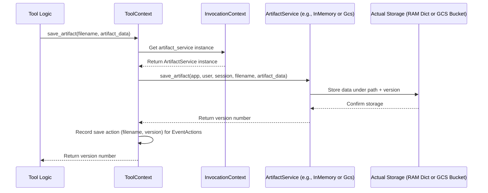

# Chapter 10: Artifact Service - Handling Files

In [Chapter 9: Code Executor](09_code_executor.md), we saw how agents can run code, potentially generating complex results or even files like charts or reports. But how does the agent manage these files? If the [Code Executor](09_code_executor.md) creates a plot image, how can the agent save it and maybe show it to the user later?

This is where the **Artifact Service** comes in. It's like a dedicated file cabinet for each conversation [Session](03_session.md).

## Use Case: Saving a Generated Plot

Imagine our agent uses the [Code Executor](09_code_executor.md) to analyze some data and generate a visualization, like a PNG image file named `sales_chart.png`.

*   The code runs and creates the image data.
*   The agent needs a way to **save** this image file (`sales_chart.png`) so it's associated with the current conversation.
*   Later, if the user asks, "Show me that sales chart again," the agent needs to **load** the saved `sales_chart.png` file.

The Artifact Service provides the mechanism for this saving and loading within the context of a specific conversation.

## What is an Artifact Service?

Think of an **Artifact Service** as the system responsible for managing binary data (files, which we call "artifacts") related to a specific conversation [Session](03_session.md). Each session gets its own virtual storage space.

*   **Artifact:** Any piece of binary data, like an image, a PDF document, a CSV file, etc.
*   **Service:** It provides functions to save artifacts and load them back later.

It ensures that files generated during one conversation don't get mixed up with files from another.

## Key Concepts: Saving, Loading, and Storage

### 1. Saving Files: `save_artifact`

When an [Agent](01_agent.md) or a [Tool](04_tool.md) generates data it wants to keep (like our `sales_chart.png` image), it uses the `save_artifact` function.

*   It needs to provide:
    *   The `filename` (e.g., `"sales_chart.png"`).
    *   The actual data to save (usually as a `google.genai.types.Part` object, which includes the binary data and its type, like `image/png`).
*   The Artifact Service stores this data, associating it with the current `app_name`, `user_id`, and `session_id`.
*   It returns a `version` number (starting from 0) for the saved file. If you save the same filename again, it creates a new version.

### 2. Loading Files: `load_artifact`

When an agent needs to retrieve a previously saved file, it uses the `load_artifact` function.

*   It needs to provide the `filename` it wants to load (e.g., `"sales_chart.png"`).
*   Optionally, it can request a specific `version`. If no version is specified, it usually gets the latest one.
*   The Artifact Service looks up the file in the storage associated with the current session and returns the data (again, as a `google.genai.types.Part` object), or `None` if the file doesn't exist.

### 3. Where Files Live: Implementations

Just like we saw different ways to store conversation history with the [Session Service](03_session.md) (in memory, database, cloud), the Artifact Service also has different implementations determining the actual storage location:

*   **`InMemoryArtifactService`** (`src/google/adk/artifacts/in_memory_artifact_service.py`):
    *   **Analogy:** Sticky notes with file contents attached to your monitor.
    *   Stores all artifacts directly in the computer's RAM.
    *   **Pros:** Very fast, requires no external setup, great for testing.
    *   **Cons:** All files are lost when your application stops or restarts.
    *   The `InMemoryRunner` we used in previous chapters typically uses this by default.

*   **`GcsArtifactService`** (`src/google/adk/artifacts/gcs_artifact_service.py`):
    *   **Analogy:** A secure, organized filing cabinet in the cloud (Google Cloud Storage).
    *   Stores artifacts as objects in a specified Google Cloud Storage (GCS) bucket.
    *   **Pros:** Persistent (files survive restarts), scalable, secure.
    *   **Cons:** Requires setting up a GCS bucket in Google Cloud Platform.

The choice of implementation depends on your needs for persistence and scalability.

## How to Use the Artifact Service (via Context)

You typically don't interact with the Artifact Service *directly*. Instead, you use helper methods provided by the context object available within your [Tools](04_tool.md) or callbacks, usually the `ToolContext` or `CallbackContext` (which we learned about in [Chapter 7: Invocation Context](07_invocation_context.md)). These context objects get access to the *actual* configured Artifact Service instance behind the scenes.

Let's imagine we have a special tool that runs code and saves any resulting image.

**Example: Saving an Artifact from a Tool**

```python
# --- Assume Tool setup (imports, etc.) ---
from google.adk.tools import FunctionTool, ToolContext
from google.genai import types

# Imagine this is the binary data of a PNG image generated by code
generated_image_bytes = b'\x89PNG\r\n\x1a\n...' # Placeholder for actual image data

def run_code_and_save_plot(code_to_run: str, output_filename: str, tool_context: ToolContext) -> str:
  """
  Runs Python code that is expected to generate a plot.
  Saves the plot as an artifact.

  Args:
      code_to_run: The Python code snippet to execute.
      output_filename: The desired filename for the saved plot artifact (e.g., 'plot.png').
      tool_context: The context object provided by the ADK framework.

  Returns:
      A message indicating success or failure.
  """
  print(f"--- Tool: Running code (details skipped) ---")
  # --- Pretend code execution happens here ---
  # Let's assume it produces the `generated_image_bytes`

  print(f"--- Tool: Code generated image data ---")

  # Create a GenAI Part object from the raw bytes
  image_artifact = types.Part.from_bytes(
      data=generated_image_bytes,
      mime_type="image/png" # Important: specify the type!
  )

  try:
    # Use the context to save the artifact!
    version = tool_context.save_artifact(
        filename=output_filename,
        artifact=image_artifact
    )
    print(f"--- Tool: Saved artifact '{output_filename}' (version {version}) ---")
    
    # The fact that we saved is automatically recorded in the Event's actions
    return f"Successfully generated and saved '{output_filename}' as version {version}."
  except Exception as e:
    print(f"--- Tool: Error saving artifact: {e} ---")
    return f"Error saving artifact '{output_filename}': {e}"

# --- Wrapping it as a Tool ---
# code_saver_tool = FunctionTool(run_code_and_save_plot)

# --- Agent using this tool (hypothetical) ---
# plotting_agent = LlmAgent(..., tools=[code_saver_tool])
```

*   We define a hypothetical function `run_code_and_save_plot`. Notice it takes `tool_context: ToolContext` as an argument – the ADK framework automatically provides this when the tool runs.
*   Inside the function, after generating the `generated_image_bytes`, we wrap it in `types.Part`, specifying the `mime_type`.
*   Crucially, we call `tool_context.save_artifact(...)`. This delegates the saving operation to the underlying Artifact Service configured in the [Runner](02_runner.md).
*   The `ToolContext` handles telling the framework about the save, so it gets recorded in the `EventActions` of the resulting "tool" [Event](08_event.md).

**Example: Loading an Artifact in a Tool**

Now, imagine another tool needs to load that saved image.

```python
# --- Assume Tool setup ---
from google.adk.tools import FunctionTool, ToolContext
from google.genai import types
from typing import Optional # To indicate the return type might be None

def load_and_describe_image(filename: str, tool_context: ToolContext) -> Optional[str]:
  """
  Loads a previously saved image artifact and returns its description (placeholder).

  Args:
      filename: The filename of the artifact to load.
      tool_context: The context object provided by the ADK framework.

  Returns:
      A description of the image, or None if not found.
  """
  print(f"--- Tool: Attempting to load artifact '{filename}' ---")
  try:
    # Use the context to load the artifact (latest version)
    loaded_artifact: Optional[types.Part] = tool_context.load_artifact(filename=filename)

    if loaded_artifact:
      print(f"--- Tool: Loaded artifact '{filename}' (mime_type: {loaded_artifact.inline_data.mime_type}) ---")
      # --- In a real tool, you might send this image data to another model for analysis ---
      # --- or pass it back to the primary LLM ---
      # For simplicity, we just return a placeholder description
      return f"Loaded artifact '{filename}'. It appears to be an image of type {loaded_artifact.inline_data.mime_type}."
    else:
      print(f"--- Tool: Artifact '{filename}' not found. ---")
      return f"Artifact '{filename}' could not be found."
  except Exception as e:
      print(f"--- Tool: Error loading artifact: {e} ---")
      return f"Error loading artifact '{filename}': {e}"

# --- Wrapping it as a Tool ---
# image_loader_tool = FunctionTool(load_and_describe_image)

# --- Agent using this tool (hypothetical) ---
# describing_agent = LlmAgent(..., tools=[image_loader_tool])
```

*   The `load_and_describe_image` function also takes `tool_context`.
*   It calls `tool_context.load_artifact(filename=...)` to retrieve the latest version of the file.
*   If the artifact is found, it's returned as a `types.Part` object, which contains the binary data and mime type. The tool can then process this data.

These `save_artifact` and `load_artifact` methods on the `ToolContext` provide a convenient way for your tools to interact with the session's file storage without needing to know the specific implementation details (InMemory, GCS, etc.).

## Internal Implementation: Behind the Scenes

What happens when `tool_context.save_artifact()` is called?

1.  **Context Delegates:** The `ToolContext` (or `CallbackContext`) receives the call. It accesses the actual `artifact_service` instance stored within the `InvocationContext` it wraps.
2.  **Service Method Called:** It calls the `save_artifact` method on that specific service instance (e.g., `InMemoryArtifactService.save_artifact(...)` or `GcsArtifactService.save_artifact(...)`), passing along the `app_name`, `user_id`, `session_id` (all retrieved from the `InvocationContext`), plus the `filename` and `artifact` data.
3.  **Storage Logic:**
    *   `InMemoryArtifactService`: Looks up or creates a list in its internal dictionary for the given `app_name/user_id/session_id/filename` path and appends the new `artifact` data to the list. The index of the appended item becomes the version number.
    *   `GcsArtifactService`: Constructs a GCS blob path (like `app/user/session/file/version`), calculates the next version number based on existing blobs with that prefix, and uploads the `artifact` data to the GCS bucket using the Google Cloud Storage client library.
4.  **Version Returned:** The storage service returns the new `version` number.
5.  **Action Recorded:** The `ToolContext` notes that `save_artifact` was called, storing the `filename` and `version` pair. This information will be added to the `artifact_delta` field within the `EventActions` of the `Event` generated when the tool finishes execution. This ensures the save operation is logged in the conversation history.

Loading follows a similar path, with the context delegating to the service's `load_artifact` method, which retrieves data from its specific storage (memory dictionary or GCS bucket).

Here's a simple diagram showing the flow for saving:



## Peeking Inside the Code

Let's look at the core interface and one implementation.

**1. `BaseArtifactService` Interface (`src/google/adk/artifacts/base_artifact_service.py`)**

This defines the standard methods any artifact storage system must provide.

```python
# Simplified from src/google/adk/artifacts/base_artifact_service.py
from abc import ABC, abstractmethod
from typing import Optional
from google.genai import types # For types.Part

class BaseArtifactService(ABC):
  """Abstract base class for artifact services."""

  @abstractmethod
  def save_artifact(
      self, *, app_name: str, user_id: str, session_id: str,
      filename: str, artifact: types.Part
  ) -> int:
    """Saves an artifact, returns the version ID."""
    pass

  @abstractmethod
  def load_artifact(
      self, *, app_name: str, user_id: str, session_id: str,
      filename: str, version: Optional[int] = None
  ) -> Optional[types.Part]:
    """Gets an artifact, returns Part or None."""
    pass

  @abstractmethod
  def list_artifact_keys(
      self, *, app_name: str, user_id: str, session_id: str
  ) -> list[str]:
    """Lists all artifact filenames within a session."""
    pass

  # ... other methods like delete_artifact, list_versions ...
```

**2. `InMemoryArtifactService` (`src/google/adk/artifacts/in_memory_artifact_service.py`)**

This implementation uses a dictionary to store lists of artifact versions.

```python
# Simplified from src/google/adk/artifacts/in_memory_artifact_service.py
from typing import Optional, Dict, List
from google.genai import types
from pydantic import BaseModel, Field
from .base_artifact_service import BaseArtifactService

class InMemoryArtifactService(BaseArtifactService, BaseModel):
  """An in-memory implementation of the artifact service."""

  # Storage: { "app/user/session/filename": [version0_Part, version1_Part, ...] }
  artifacts: Dict[str, List[types.Part]] = Field(default_factory=dict)

  def _artifact_path(self, app, user, session, filename) -> str:
      # Helper to create the dictionary key
      # Handles special "user:" namespace prefix if needed
      # return f"{app}/{user}/{session}/{filename}" # simplified version
      pass

  def save_artifact(
      self, *, app_name, user_id, session_id, filename, artifact
  ) -> int:
    path = self._artifact_path(app_name, user_id, session_id, filename)
    if path not in self.artifacts:
      self.artifacts[path] = [] # Create list if first time
    version = len(self.artifacts[path]) # Version is the current list length
    self.artifacts[path].append(artifact) # Add the new version
    return version

  def load_artifact(
      self, *, app_name, user_id, session_id, filename, version=None
  ) -> Optional[types.Part]:
    path = self._artifact_path(app_name, user_id, session_id, filename)
    versions_list = self.artifacts.get(path)
    if not versions_list:
      return None # File not found
    if version is None:
      version = -1 # Get the latest version by default
    try:
      return versions_list[version]
    except IndexError:
      return None # Version not found

  def list_artifact_keys(self, *, app_name, user_id, session_id) -> list[str]:
    # Logic to iterate through self.artifacts keys and extract filenames
    # matching the app/user/session prefix
    pass
```

The `GcsArtifactService` works similarly but interacts with `google.cloud.storage` methods like `bucket.blob()` and `blob.upload_from_string()` / `blob.download_as_bytes()`.

The specific Artifact Service instance is usually configured when you create the [Runner](02_runner.md), similar to how you configure the [Session Service](03_session.md). The `InMemoryRunner` bundles the `InMemoryArtifactService` for convenience.

## Conclusion

The **Artifact Service** provides essential file management capabilities for your ADK agents, allowing them to store and retrieve binary data associated with specific conversation sessions.

*   It acts like a per-session file cabinet.
*   Agents use `save_artifact` and `load_artifact` (typically via the `ToolContext` or `CallbackContext`) to manage files like images, documents, or data files.
*   Implementations like `InMemoryArtifactService` (temporary, RAM-based) and `GcsArtifactService` (persistent, cloud-based) determine where the files are actually stored.
*   Saved artifacts are recorded in the `Event` history via `EventActions`.

This allows agents to work with non-textual data generated during a conversation, making them much more versatile.

Now that we've covered how agents work, remember, interact, and handle data, how do we manage permissions and identity, especially when tools need to access external services securely? That's the topic of our next chapter.

**Next:** [Chapter 11: Authentication](11_authentication.md)

---

Generated by [AI Codebase Knowledge Builder](https://github.com/The-Pocket/Tutorial-Codebase-Knowledge)