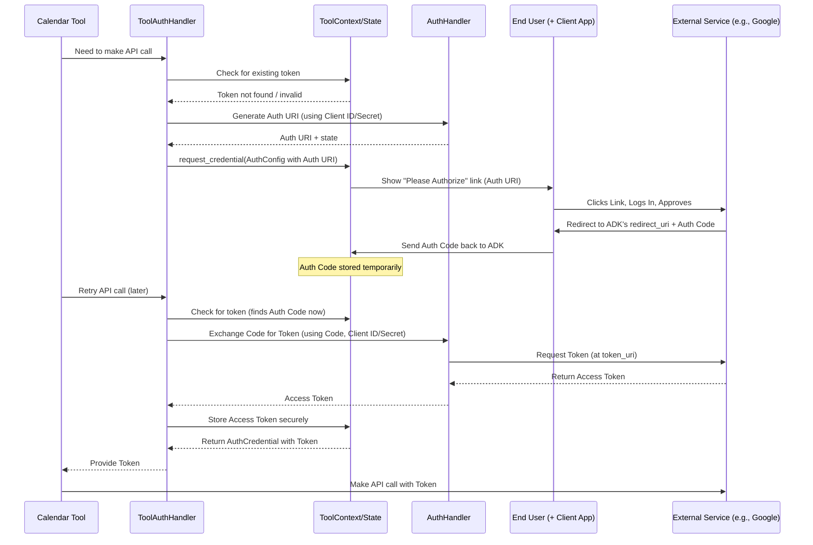

# Chapter 11: Authentication - Unlocking Secure Access

In the previous chapter, [Chapter 10: Artifact Service - Handling Files](10_artifact_service.md), we learned how agents can manage files like images or documents generated during a conversation. Now, what happens when an agent needs to use a [Tool](04_tool.md) that interacts with an *external* service, like your Google Calendar, your GitHub account, or a company database? These services need to know *who* is asking and *if they have permission*.

This chapter is all about **Authentication** – the process of securely proving identity and getting permission for tools to access external resources on behalf of the user.

## Use Case: Adding an Event to Your Calendar

Imagine you build an agent with a `GoogleCalendarTool`. You ask the agent: "Schedule a meeting for tomorrow at 2 PM about project planning."

How does the `GoogleCalendarTool` get permission to add an event to *your* specific calendar? It can't just access anyone's calendar! It needs to:

1.  Ask Google Calendar: "I want to add an event for this user."
2.  Prove to Google Calendar: "This user has given me permission to do this."

Authentication is the mechanism within the ADK that manages this secure handshake.

## What is Authentication in the ADK?

Think of Authentication in the ADK as the **security system** for your agent's tools. It manages the keys, passwords, and special tokens required to access external services securely. It ensures that tools only access data they have explicit permission for, often requiring the user's involvement initially.

This system involves several key components:

1.  **Authentication Scheme (`AuthScheme`)**: Defines *how* a service requires authentication. Is it a simple password? A special key? A complex login flow like OAuth 2.0? This is like knowing whether a door needs a physical key, a keycard, or a fingerprint.
2.  **Authentication Credential (`AuthCredential`)**: Holds the *actual data* needed to authenticate according to a specific scheme. This could be the username/password, the API key, or temporary codes and tokens obtained during a login flow. This is the actual key or keycard.
3.  **Authentication Handlers (`AuthHandler`, `ToolAuthHandler`)**: These are the managers that orchestrate the authentication process. They know how to use the Scheme and Credentials, guide the user through login steps if necessary (like redirecting to a Google login page), and securely handle the sensitive tokens.

## Key Concepts: Understanding the Pieces

Let's break down the core ideas.

### 1. `AuthScheme`: The Type of Lock

An `AuthScheme` tells the ADK what *kind* of authentication method an external service uses. The ADK uses definitions based on standard OpenAPI security schemes. Common types include:

*   **`apiKey`**: A simple secret key that the tool sends with its request.
*   **`http`**: Standard web authentication, like Basic Auth (username/password) or Bearer tokens (sending a token in the header).
*   **`oauth2`**: A common standard for delegated access. This is what services like Google, GitHub, etc., use. It allows a user to grant specific permissions to an application (like our agent's tool) without sharing their actual password. This often involves the user being redirected to the service's login page.
*   **`openIdConnect`**: Built on top of OAuth 2.0, often used for single sign-on and getting user profile information.
*   **`serviceAccount`**: A special type often used for server-to-server communication, particularly within Google Cloud.

A tool needing authentication will declare which `AuthScheme` it supports.

```python
# Simplified concept of defining schemes
# (Usually defined in OpenAPI specs or tool configurations)
from google.adk.auth import AuthSchemeType # Enum for types

# Example: An API Key scheme
# api_key_scheme = AuthScheme(type=AuthSchemeType.apiKey, name="X-API-KEY", in_="header") 

# Example: An OAuth2 scheme (Authorization Code flow)
# oauth_scheme = AuthScheme(
#     type=AuthSchemeType.oauth2,
#     flows=OAuthFlows(
#         authorizationCode=AuthorizationCodeFlow(
#             authorizationUrl="https://example.com/auth",
#             tokenUrl="https://example.com/token",
#             scopes={"calendar:write": "Modify calendar events"}
#         )
#     )
# )
```
*(See `src/google/adk/auth/auth_schemes.py`)*

This code snippet shows the idea – the scheme defines the method (`apiKey`, `oauth2`), necessary details (header name for API key, URLs and permissions (`scopes`) for OAuth2).

### 2. `AuthCredential`: The Key

An `AuthCredential` holds the actual secrets needed for a specific `AuthScheme`. Its structure changes depending on the `auth_type`.

```python
# Simplified structure from src/google/adk/auth/auth_credential.py
from pydantic import BaseModel
from typing import Optional, Dict, List

class HttpAuth(BaseModel): # For HTTP schemes
    scheme: str # e.g., "basic", "bearer"
    credentials: Dict # e.g., {"username": "...", "password": "..."} or {"token": "..."}

class OAuth2Auth(BaseModel): # For OAuth2/OpenID Connect
    client_id: Optional[str] = None
    client_secret: Optional[str] = None
    auth_uri: Optional[str] = None # URL for user login
    state: Optional[str] = None # Security value for OAuth flow
    redirect_uri: Optional[str] = None # Where user is sent back after login
    auth_code: Optional[str] = None # Temporary code after login
    token: Optional[Dict] = None # The actual access token!

class ServiceAccount(BaseModel): # For GCP Service Accounts
    scopes: List[str]
    # ... fields for service account JSON key file ...

class AuthCredential(BaseModel):
    auth_type: str # Matches AuthSchemeType (e.g., "apiKey", "http", "oauth2")
    api_key: Optional[str] = None
    http: Optional[HttpAuth] = None
    oauth2: Optional[OAuth2Auth] = None
    service_account: Optional[ServiceAccount] = None
    # resource_ref: Optional[str] = None # Future use
```

This shows how the `AuthCredential` object can hold different kinds of information depending on the `auth_type`. For OAuth2, it holds details needed for the flow and eventually the precious `token`.

### 3. Handling the Flow (The OAuth 2.0 Example)

OAuth 2.0 is common and involves multiple steps, often requiring user interaction:

1.  **Tool Needs Access:** The `GoogleCalendarTool` tries to run.
2.  **Check for Token:** The ADK checks if it already has a valid access `token` for Google Calendar for this user.
3.  **No Token - Start Flow:** If no valid token exists, the ADK (using the `AuthHandler` logic) generates a special **Authorization URL** (`auth_uri`) using the `client_id` provided for the tool and the `authorizationUrl` from the `AuthScheme`.
4.  **User Interaction:** The ADK tells the user (usually via the chat interface): "This tool needs access to your Google Calendar. Please click this link to approve: [Authorization URL]".
5.  **User Approves:** The user clicks the link, logs into Google (if not already logged in), sees what permissions the tool is requesting (e.g., "manage your calendar"), and clicks "Allow".
6.  **Redirect with Code:** Google redirects the user's browser back to a special address (`redirect_uri`) specified by the ADK, adding a temporary `auth_code` to the URL.
7.  **ADK Gets Code:** The ADK framework captures this `auth_code`.
8.  **Exchange Code for Token:** The `AuthHandler` securely sends the `auth_code`, along with the `client_id` and `client_secret`, to Google's `tokenUrl` (defined in the `AuthScheme`).
9.  **Receive Token:** Google verifies everything and sends back the actual access `token` (and often a refresh token).
10. **Store Token Securely:** The ADK stores this `token` (usually associated with the user/session state) for future use.
11. **Tool Runs:** Now the tool can use the stored `token` to make its API call to Google Calendar.

This seems complex, but the ADK's authentication handlers manage most of these steps. The key part is the user interaction (#4-6).

### 4. `AuthHandler` and `ToolAuthHandler`: The Managers

*   **`AuthHandler` (`src/google/adk/auth/auth_handler.py`)**: Contains the core logic for generating authorization URIs and exchanging codes for tokens based on the `AuthScheme` and `AuthCredential`.
*   **`ToolAuthHandler` (`src/google/adk/tools/openapi_tool/openapi_spec_parser/tool_auth_handler.py`)**: A specialized handler used internally by tools (especially those defined via OpenAPI specs). It works closely with the `ToolContext` to check for existing credentials, request new ones if needed (triggering the user interaction flow described above), and manage the storage of exchanged tokens within the context/session state.

## How Tools Use Authentication

As a developer using or building tools, you mainly interact with authentication in these ways:

**1. Declaring Auth Needs (Tool Configuration):**
When a tool is defined (often via an OpenAPI specification for API-based tools), its security requirements (the `AuthScheme`) are declared. The tool might also need initial configuration like a `client_id` and `client_secret` (provided securely when setting up the agent/tool).

**2. Requesting Credentials (Inside a Tool via Context):**
If a tool runs and finds it doesn't have the necessary credentials (e.g., a valid token), the `ToolAuthHandler` (working behind the scenes) uses the `ToolContext` to signal back to the framework that authentication is needed.

```python
# Simplified concept within ToolAuthHandler or similar logic

# from google.adk.auth import AuthConfig
# from google.adk.tools import ToolContext 

def ensure_credentials(tool_context: ToolContext, required_scheme: AuthScheme, initial_credential: AuthCredential):
    # 1. Check if a valid token already exists (using ToolContextCredentialStore)
    existing_token = tool_context.get_auth_response(AuthConfig(auth_scheme=required_scheme, ...))
    
    if is_valid(existing_token):
      print("--- Auth: Found valid token ---")
      return existing_token # Use this token for the API call
      
    else:
      print("--- Auth: No valid token found, requesting user auth ---")
      # 2. Prepare the configuration for the auth request
      auth_config_request = AuthConfig(
          auth_scheme=required_scheme,
          raw_auth_credential=initial_credential # e.g., contains client_id/secret
          # exchanged_auth_credential will be filled by AuthHandler/User
      )
      
      # 3. Tell the framework to start the auth flow
      tool_context.request_credential(auth_config_request) 
      
      # Tool execution stops here for this turn, waiting for user auth
      raise NeedsAuthenticationError("User authentication required.") 
```
This pseudo-code shows the core idea: check for a token, if missing/invalid, use `tool_context.request_credential` to trigger the user authentication flow.

**3. `AuthConfig`: The Request/Response Bundle**
The `AuthConfig` object acts as the communication package between the tool needing auth, the ADK framework, and the client handling user interaction.

```python
# Simplified structure from src/google/adk/auth/auth_tool.py
from pydantic import BaseModel
# Assuming AuthScheme and AuthCredential are defined as above

class AuthConfig(BaseModel):
  """Carries auth info between tool, ADK, and client."""
  
  auth_scheme: AuthScheme 
  """Defines HOW to authenticate (e.g., OAuth2)."""
  
  raw_auth_credential: Optional[AuthCredential] = None
  """Initial info provided by tool (e.g., client_id/secret)."""
  
  exchanged_auth_credential: Optional[AuthCredential] = None
  """Holds the results of the flow (e.g., auth_uri for user, 
     or later the auth_code, and finally the access token)."""
```
When `tool_context.request_credential` is called, it sends this `AuthConfig` (often with just `auth_scheme` and `raw_auth_credential` filled). The `AuthHandler` might fill the `auth_uri` into `exchanged_auth_credential`. The client shows the user the `auth_uri`. After the user approves and is redirected, the client updates `exchanged_auth_credential` with the `auth_code`. Finally, the `AuthHandler` exchanges the code for a token, updating `exchanged_auth_credential` with the final token.

## Internal Implementation: Simplified OAuth 2.0 Flow

Let's trace the steps when a tool needs OAuth 2.0 access for the first time.

1.  **Tool Run:** `GoogleCalendarTool` starts.
2.  **Check Cache:** `ToolAuthHandler` checks `ToolContextCredentialStore` (which looks in session state) for a valid token matching the tool's required `AuthScheme` and `raw_auth_credential` (e.g., client ID).
3.  **Cache Miss:** No valid token found.
4.  **Generate Auth URI:** `ToolAuthHandler` asks `AuthHandler` to generate the authorization URL (`auth_uri`) and `state` using the `AuthScheme` details and the `client_id`/`client_secret` from `raw_auth_credential`.
5.  **Request Credential:** `ToolAuthHandler` calls `tool_context.request_credential()` with an `AuthConfig` containing the scheme, raw credential, and the generated `auth_uri` now placed in `exchanged_auth_credential`.
6.  **Framework Signals Client:** The ADK framework receives this request and signals the client application (e.g., the web UI showing the chat) that user authentication is needed, providing the `auth_uri`.
7.  **User Interaction:** The client displays the link ("Click here to authorize..."). User clicks, logs into Google, approves.
8.  **Redirect & Code Capture:** Google redirects to the `redirect_uri`. The client captures the `auth_code` and `state` from the URL.
9.  **Client Updates ADK:** The client sends the captured `auth_code` and `state` back to the ADK framework, updating the `exchanged_auth_credential` within the context of the ongoing session/invocation.
10. **Tool Retries (Next Turn):** Later (maybe the next time the user interacts or the tool is explicitly retried), the `GoogleCalendarTool` runs again.
11. **Check Cache Again:** `ToolAuthHandler` checks the store. It might still not have the final token, but the `exchanged_auth_credential` associated with the context now contains the `auth_code`.
12. **Exchange Code:** `ToolAuthHandler` (or `AuthHandler`) detects the `auth_code` is present. It calls the `tokenUrl` from the `AuthScheme`, sending the `auth_code`, `client_id`, and `client_secret`.
13. **Get Token:** The token endpoint returns the access `token`.
14. **Store Token:** The `ToolAuthHandler`/`ToolContextCredentialStore` stores the final `token` (updating `exchanged_auth_credential` and saving it to the session state).
15. **Use Token:** The `ToolAuthHandler` now returns the valid `AuthCredential` containing the token. The `GoogleCalendarTool` uses this token in its API request header (e.g., `Authorization: Bearer <token>`).



## Conclusion

Authentication is crucial for enabling agents to securely interact with external services that require user permission.

*   The ADK provides components like **`AuthScheme`** (the method), **`AuthCredential`** (the secrets/tokens), and handlers (**`AuthHandler`**, **`ToolAuthHandler`**) to manage this.
*   Tools declare their authentication needs, and the ADK framework, often in conjunction with a client application and user interaction, handles the complex flows like OAuth 2.0.
*   The `ToolContext` provides tools with a way to request authentication (`request_credential`) and eventually receive the necessary credentials (like tokens) to interact with the service.
*   The `AuthConfig` object facilitates communication about authentication requirements and status between the tool, the ADK, and the client.

While the underlying process can be complex, the ADK aims to abstract away much of this complexity, allowing developers to build powerful tools that securely leverage external services.

With our agent now capable of complex tasks, file handling, and secure external interactions, how do we measure how well it's performing?

**Next:** [Chapter 12: Evaluation](12_evaluation.md)

---

Generated by [AI Codebase Knowledge Builder](https://github.com/The-Pocket/Tutorial-Codebase-Knowledge)