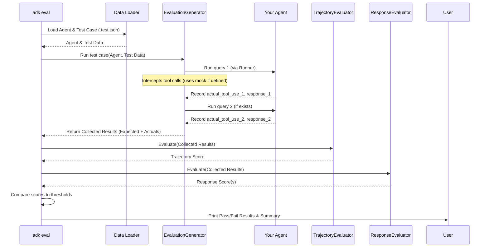

# Chapter 12: Evaluation - Checking Your Agent's Homework

Welcome to the final chapter of our core ADK tutorial! In [Chapter 11: Authentication](11_authentication.md), we learned how to securely give our agents access to external services. Now that we've built agents that can remember ([Session](03_session.md)), use tools ([Tool](04_tool.md)), run code ([Code Executor](09_code_executor.md)), handle files ([Artifact Service](10_artifact_service.md)), and access external services ([Authentication](11_authentication.md)), how do we make sure they actually *work* correctly and reliably?

Think about building any software – you need to test it! How do you test an AI agent? That's where the **Evaluation** framework comes in.

## Use Case: Did the Math Agent Get It Right?

Remember our `MathAgent` from [Chapter 4: Tool](04_tool.md)? We gave it a calculator tool (`add_numbers`). How can we be sure that:

1.  When asked "What is 5 + 7?", it *actually uses* the `add_numbers` tool? (Correct tool usage)
2.  The final answer it gives is "5 + 7 is 12." or something very similar? (Correct final response)

We need a way to define these expectations and automatically run the agent against them to check its performance.

## What is Evaluation in the ADK?

The Evaluation part of the ADK is like a **quality assurance department** for your agents. It provides tools and structures to:

1.  **Define Test Cases:** Create files (`.test.json`) that specify sample conversations, including user queries, the expected sequence of tool calls, and the expected final answer.
2.  **Run Tests:** Execute your agent against these test cases using the `AgentEvaluator` mechanism (often triggered via the `adk eval` command-line tool).
3.  **Measure Performance:** Automatically assess how well the agent performed based on specific criteria using evaluators like `TrajectoryEvaluator` (for tool usage) and `ResponseEvaluator` (for the final answer).

This helps you catch regressions (when changes break existing functionality) and ensure your agent behaves as expected before deploying it.

## Key Concepts

Let's look at the essential pieces of the evaluation framework.

### 1. Test Datasets (`.test.json` Files)

The foundation of evaluation is the test data. You define your test cases in JSON files, typically ending with `.test.json`. Each file contains a list of evaluation scenarios.

Each scenario usually includes:

*   `name`: A unique name for this specific test case (e.g., "addition_test").
*   `data`: A list representing the conversation turns. Each turn is a dictionary.
*   `initial_session` (optional): Defines any starting state for the session's memory (`state`) or artifacts.

Each turn dictionary (`data` item) usually has:

*   `query`: The user's message for this turn.
*   `expected_tool_use` (optional): A list describing the tools the agent *should* call in response to the query, including the tool name and input arguments.
*   `reference` (optional): The expected final text response from the agent for this turn.
*   `mock_tool_output` (optional, within `expected_tool_use`): If you want to provide a fake result for a tool call during the test (to avoid calling external services or ensure consistent results), you can specify it here.

**Example: `math_agent_tests.test.json`**

```json
[
  {
    "name": "simple_addition",
    "data": [
      {
        "query": "What is 5 plus 7?",
        "expected_tool_use": [
          {
            "tool_name": "add_numbers",
            "tool_input": {
              "a": 5.0,
              "b": 7.0
            }
            // No mock_tool_output needed if we want the real tool to run
          }
        ],
        "reference": "5 plus 7 is 12."
      }
    ]
  },
  {
    "name": "addition_with_mock",
    "data": [
      {
        "query": "Add 10 and 20",
        "expected_tool_use": [
          {
            "tool_name": "add_numbers",
            "tool_input": {
              "a": 10.0,
              "b": 20.0
            },
            "mock_tool_output": 30.0 // Force the tool to return 30.0 during this test
          }
        ],
        "reference": "The sum of 10 and 20 is 30."
      }
    ]
  }
]
```

This file defines two test cases for our `MathAgent`. The first checks the actual tool execution, while the second uses a mock output.

### 2. Evaluators: The Graders

Once the agent runs against the test case, the evaluators compare the actual behavior to the expected behavior defined in the `.test.json` file.

*   **`AgentEvaluator` (`src/google/adk/evaluation/agent_evaluator.py`) / `EvaluationGenerator` (`src/google/adk/evaluation/evaluation_generator.py`)**:
    *   These components orchestrate the process. They load the agent, read the `.test.json` file, and run the agent through each `query` in the test case.
    *   They use a temporary [Runner](02_runner.md) and [Session](03_session.md) for each test run.
    *   Crucially, `EvaluationGenerator` intercepts tool calls. If a `mock_tool_output` is defined in the test case, it returns that value directly instead of running the actual tool code.
    *   It records the *actual* final text response and the *actual* sequence of tool calls (`actual_tool_use`) made by the agent during the test run.

*   **`TrajectoryEvaluator` (`src/google/adk/evaluation/trajectory_evaluator.py`)**:
    *   **Analogy:** Checking if the student showed the correct steps to solve a math problem.
    *   Compares the `actual_tool_use` recorded during the run with the `expected_tool_use` from the `.test.json` file.
    *   It performs an exact match check on the sequence of tool names and their input arguments.
    *   Returns a score: `1.0` for a perfect match, `0.0` otherwise.

*   **`ResponseEvaluator` (`src/google/adk/evaluation/response_evaluator.py`)**:
    *   **Analogy:** Checking if the student's final answer is correct or close enough.
    *   Compares the agent's final text `response` with the `reference` text from the `.test.json` file.
    *   It can use different metrics:
        *   **ROUGE (`response_match_score`)**: Measures text similarity (how many words overlap). Good for checking if key information is present. Score range [0, 1].
        *   **LLM-based (`response_evaluation_score`)**: Uses another LLM to judge the quality (e.g., coherence, relevance) of the agent's response compared to the query and reference. Score range [0, 5].

### 3. Evaluation Criteria (`test_config.json`)

How do you decide if a score is "good enough"? You can define thresholds in a `test_config.json` file placed in the same directory as your `.test.json` files.

**Example: `test_config.json`**

```json
{
  "criteria": {
    "tool_trajectory_avg_score": 1.0,
    "response_match_score": 0.8
  }
}
```

This configuration requires a perfect tool usage score (`1.0`) and a ROUGE similarity score of at least `0.8`. If no `test_config.json` is found, default thresholds are used (see `src/google/adk/cli/cli_eval.py`).

## Running an Evaluation (Using the Command Line)

While you can use the Python classes like `AgentEvaluator` directly, the simplest way to run evaluations is often using the ADK command-line interface (CLI). *(Note: You might need to install the evaluation dependencies: `pip install google-adk[eval]`)*

**Step 1: Create Your Test Files**
Save the example `.test.json` and `test_config.json` content above into files named `math_agent_tests.test.json` and `test_config.json` in a directory (e.g., `my_agent/tests/`). Make sure your `MathAgent` code (including the `add_numbers` tool) is defined in a Python module (e.g., `my_agent/agent.py` with an `__init__.py` in `my_agent/`).

**Step 2: Run the `adk eval` Command**

Open your terminal, navigate to the directory *containing* your `my_agent` folder, and run:

```bash
adk eval \
  --agent_module_path my_agent \
  --eval_set_file_path my_agent/tests/math_agent_tests.test.json \
  --eval_config_file_path my_agent/tests/test_config.json
```

*   `--agent_module_path`: Specifies the Python module containing your agent definition (expecting `my_agent/agent.py` with `root_agent` defined).
*   `--eval_set_file_path`: Points to your test case file. You can specify multiple files or even select specific tests within a file (e.g., `my_agent/tests/math_agent_tests.test.json:simple_addition`).
*   `--eval_config_file_path`: Points to your criteria configuration.

**Step 3: Interpret the Output**

The command will run your agent against each test case and print results like this (simplified):

```
Running Eval: my_agent/tests/math_agent_tests.test.json:simple_addition
Metric: tool_trajectory_avg_score	Status: EvalStatus.PASSED	Score: 1.0	Threshold: 1.0
Metric: response_match_score	Status: EvalStatus.PASSED	Score: 0.857...	Threshold: 0.8
Result: ✅ Passed

Running Eval: my_agent/tests/math_agent_tests.test.json:addition_with_mock
Metric: tool_trajectory_avg_score	Status: EvalStatus.PASSED	Score: 1.0	Threshold: 1.0
Metric: response_match_score	Status: EvalStatus.PASSED	Score: 0.923...	Threshold: 0.8
Result: ✅ Passed

Summary:
-----------------------------
| File                              | Eval ID            | Status          |
|-----------------------------------|--------------------|-----------------|
| my_agent/tests/math_agent_tests.json | simple_addition    | ✅ PASSED        |
| my_agent/tests/math_agent_tests.json | addition_with_mock | ✅ PASSED        |
-----------------------------
All 2 evaluations passed.
```

The output shows:
*   Which test case is running.
*   The score for each metric defined in the criteria (`tool_trajectory_avg_score`, `response_match_score`).
*   Whether the score met the threshold (`EvalStatus.PASSED` or `EvalStatus.FAILED`).
*   The overall result for the test case (`✅ Passed` or `❌ Failed`).
*   A final summary table.

If any test case fails, the overall command might exit with an error code, suitable for use in automated testing pipelines.

## Under the Hood: The Evaluation Flow

When you run `adk eval` (or use `AgentEvaluator` directly), here's a simplified sequence of what happens for a single test case:

1.  **Load:** The framework loads your agent code (`--agent_module_path`) and the specified test case from the `.test.json` file.
2.  **Setup:** It creates a temporary, isolated [Session](03_session.md) (using `InMemorySessionService` by default) and sets up the `EvaluationGenerator`. If `initial_session` was defined, that state is loaded.
3.  **Run Agent Turn-by-Turn:** For each turn defined in the test case `data`:
    *   The `EvaluationGenerator` takes the `query`.
    *   It uses a standard [Runner](02_runner.md) to pass the query to the agent.
    *   **Intercept Tools (if mocked):** Before any tool is executed, the `EvaluationGenerator` checks if a `mock_tool_output` exists for that tool call in the `expected_tool_use`. If yes, it returns the mock output immediately. If not, the real tool runs.
    *   **Record Actuals:** It records the final text `response` generated by the agent and the sequence of actual tool calls (`actual_tool_use`) that occurred.
4.  **Collect Results:** After processing all turns in the test case, the `EvaluationGenerator` returns the collected data, including the original query, reference, expected tool use, *and* the recorded actual response and tool use.
5.  **Evaluate Trajectory:** The `TrajectoryEvaluator` receives the collected data and compares `actual_tool_use` vs `expected_tool_use`, calculating the `tool_use_accuracy` score (0 or 1 for exact match).
6.  **Evaluate Response:** The `ResponseEvaluator` receives the data and compares `response` vs `reference` using the specified metrics (e.g., ROUGE for `response_match_score`).
7.  **Compare & Report:** The scores from the evaluators are compared against the thresholds defined in the `test_config.json` (or defaults). The Pass/Fail status for each metric and the overall test case is determined and printed.



## Peeking Inside the Code

Let's look at simplified snippets illustrating the key parts.

**1. Loading and Running (Conceptual from `cli/cli_eval.py` and `EvaluationGenerator`)**

```python
# Simplified concept from cli/cli_eval.py run_evals function

# from ..evaluation.agent_evaluator import EvaluationGenerator
# from ..evaluation.response_evaluator import ResponseEvaluator
# from ..evaluation.trajectory_evaluator import TrajectoryEvaluator
import json

def run_evals(eval_set_file, root_agent, eval_metrics, ...):
    with open(eval_set_file, "r") as file:
        eval_items = json.load(file) # List of test cases

    for eval_item in eval_items:
        eval_name = eval_item["name"]
        eval_data = eval_item["data"] # List of turns
        initial_session = eval_item.get("initial_session", {})

        print(f"Running Eval: {eval_set_file}:{eval_name}")

        # 1. Run the agent against the data
        # Returns eval_data enriched with 'response' and 'actual_tool_use'
        collected_results = EvaluationGenerator._process_query_with_root_agent(
            data=eval_data,
            root_agent=root_agent,
            initial_session=initial_session,
            # ... other services ...
        )

        # 2. Evaluate results based on requested metrics
        final_eval_status = EvalStatus.PASSED # Assume pass initially
        for eval_metric in eval_metrics:
            score = None
            if eval_metric.metric_name == TOOL_TRAJECTORY_SCORE_KEY:
                score = TrajectoryEvaluator.evaluate([collected_results], ...) # Pass list of sessions
            elif eval_metric.metric_name == RESPONSE_MATCH_SCORE_KEY:
                # Returns a dict like {'rouge_1/mean': 0.85}
                response_scores = ResponseEvaluator.evaluate([collected_results], [RESPONSE_MATCH_SCORE_KEY], ...)
                score = response_scores.get("rouge_1/mean")

            # 3. Compare score to threshold
            eval_status = EvalStatus.FAILED
            if score is not None and score >= eval_metric.threshold:
                eval_status = EvalStatus.PASSED

            if eval_status == EvalStatus.FAILED:
                final_eval_status = EvalStatus.FAILED

            # Print individual metric result...

        # Print overall result for the test case...
        yield EvalResult(...) # Package results
```

**2. Trajectory Evaluation (Conceptual from `TrajectoryEvaluator`)**

```python
# Simplified concept from evaluation/trajectory_evaluator.py

class TrajectoryEvaluator:
    @staticmethod
    def evaluate(eval_dataset: list[list[dict]], ...):
        all_scores = []
        for conversation in eval_dataset: # List of conversations (sessions)
            for turn in conversation: # List of turns in a conversation
                # Compare tool calls for this turn
                expected = turn.get("expected_tool_use", [])
                actual = turn.get("actual_tool_use", [])
                # Remove mock_tool_output before comparing
                clean_expected = TrajectoryEvaluator._remove_tool_outputs(expected)

                # are_tools_equal performs an exact list comparison
                score = 1.0 if TrajectoryEvaluator.are_tools_equal(actual, clean_expected) else 0.0
                all_scores.append(score)

        # Return the average score across all turns in all conversations
        return sum(all_scores) / len(all_scores) if all_scores else 1.0
```

**3. Response Evaluation (Conceptual from `ResponseEvaluator`)**

```python
# Simplified concept from evaluation/response_evaluator.py

# Uses vertexai.preview.evaluation library
from vertexai.preview.evaluation import EvalTask
import pandas as pd

class ResponseEvaluator:
    @staticmethod
    def evaluate(raw_eval_dataset: list[list[dict]], evaluation_criteria: list[str], ...):
        metrics_to_run = []
        # Check which metrics are requested and if data is available
        if RESPONSE_MATCH_SCORE_KEY in evaluation_criteria and "reference" in raw_eval_dataset[0][0]:
             metrics_to_run.append("rouge_1") # Use ROUGE-1 for matching
        # Add other metrics like COHERENCE if requested...

        if not metrics_to_run:
            return {} # No response metrics to calculate

        # Flatten the dataset and prepare for EvalTask
        flattened_queries = [item for sublist in raw_eval_dataset for item in sublist]
        eval_df = pd.DataFrame(flattened_queries)
        # Rename columns to what EvalTask expects ('prompt', 'response', 'reference')

        # Create and run the evaluation task using Vertex AI Evaluation SDK
        eval_task = EvalTask(dataset=eval_df, metrics=metrics_to_run)
        eval_result = eval_task.evaluate()

        return eval_result.summary_metrics # Returns dict like {'rouge_1/mean': 0.85}
```

## Conclusion

Evaluation is a critical step in building reliable and effective AI agents. The ADK provides a framework to test your agents rigorously.

*   You define test scenarios in **`.test.json`** files, specifying queries, expected tool usage, and reference answers.
*   The **`AgentEvaluator`** (or `adk eval` CLI) runs your agent against these tests, handling mock tool outputs if needed.
*   The **`TrajectoryEvaluator`** checks if the agent used the correct tools in the right sequence.
*   The **`ResponseEvaluator`** checks if the agent's final answer matches the expected reference, using metrics like ROUGE or LLM-based judgment.
*   **Thresholds** in `test_config.json` determine pass/fail status.

By incorporating evaluation into your development workflow, you can build more robust, predictable, and trustworthy agents.

This concludes our journey through the core concepts of the Agent Development Kit for Python! You've learned how to create Agents, manage conversations with Runners and Sessions, give agents capabilities with Tools and Code Execution, handle files with the Artifact Service, manage security with Authentication, and now, how to test your agents with Evaluation. Congratulations on building this foundational knowledge! You're now equipped to start building more sophisticated AI applications with the ADK.

---

Generated by [AI Codebase Knowledge Builder](https://github.com/The-Pocket/Tutorial-Codebase-Knowledge)