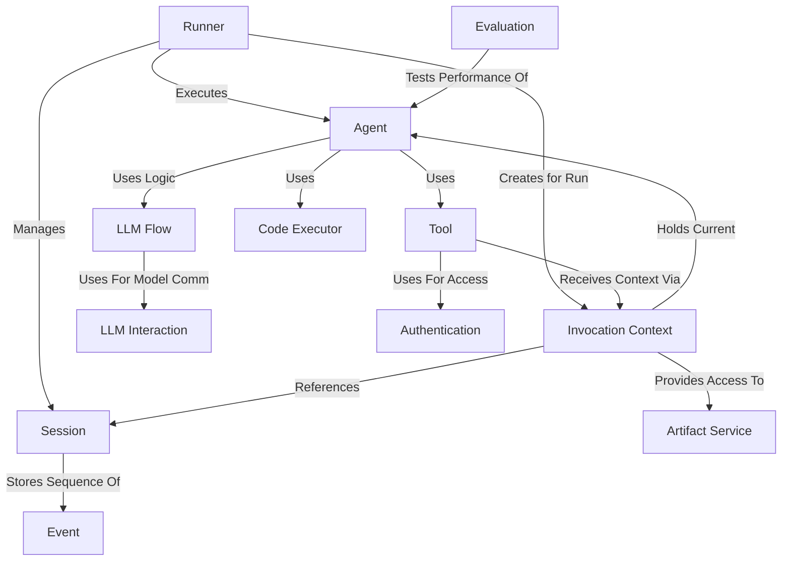

# Google Agent Development Kit (ADK) Python Tutorial

This repository contains a comprehensive tutorial for the Google Agent
Development Kit (ADK) for Python, a framework for building and running AI
Agents. The tutorial is structured as a series of chapters that guide you
through the core concepts and components of the ADK.

## What is the ADK?

The `adk-python` project provides a framework for building and running _Agents_.
Think of an **Agent** as a specialized assistant that can perform tasks,
optionally using a Large Language Model (**LLM**) to reason and decide actions.
A **Runner** executes these Agents, managing the conversation _Session_ and user
interaction. Agents can use **Tools** (like calculators, search engines, or even
other Agents) to gain new capabilities.

## Repository Structure

## Tutorial Chapters

1. [Agent](01_agent.md) - Your Specialized AI Worker
   - Introduction to the fundamental building block of the ADK
   - Creating your first LLM-powered Agent

2. [Runner](02_runner.md) - The Agent's Manager
   - How to execute Agents and manage interactions
   - Using InMemoryRunner to test your Agents

3. [Session](03_session.md) - The Conversation Memory
   - Managing conversation history and state
   - Working with different session types

4. [Tool](04_tool.md) - Extending Agent Capabilities
   - Adding specialized functions to your Agents
   - Creating and registering custom tools

5. [LLM Flow](05_llm_flow.md) - Controlling Agent Logic
   - Understanding the flow of LLM-based decision making
   - Customizing how your Agent processes information

6. [LLM Interaction](06_llm_interaction.md) - Talking to Language Models
   - How Agents communicate with LLMs
   - Configuring model parameters and handling responses

7. [Invocation Context](07_invocation_context.md) - The Agent's Environment
   - Understanding the runtime context for Agent execution
   - Accessing resources and services during execution

8. [Event](08_event.md) - Tracking What Happens
   - How the ADK records Agent actions and responses
   - Working with different event types

9. [Code Executor](09_code_executor.md) - Running Code Safely
   - Enabling Agents to execute code
   - Managing security and sandboxing

10. [Artifact Service](10_artifact_service.md) - Working with Files
    - How Agents can read and write files
    - Managing file artifacts in your applications

11. [Authentication](11_authentication.md) - Secure Access to Services
    - Providing Agents with secure access to external services
    - Managing credentials and authentication

12. [Evaluation](12_evaluation.md) - Checking Your Agent's Homework
    - Testing and evaluating Agent performance
    - Creating test cases and measuring results

## Getting Started

To get started with the tutorial:

1. Clone the [adk-python repository](https://github.com/google/adk-python)
2. These are documents only, not environment needed.
3. Start with [Chapter 1: Agent](01_agent.md) and work through the chapters
   sequentially

## Prerequisites

- Python 3.10 or higher
- Basic understanding of Python programming
- Google Cloud account (for using Vertex AI and Gemini models)

## Additional Resources

- [Official ADK-Python Repository](https://github.com/google/adk-python)
- [Google Gemini Documentation](https://ai.google.dev/docs)
- [Vertex AI Documentation](https://cloud.google.com/vertex-ai/docs)

---

## How This Tutorial Was Created

This tutorial was created using
[AI Codebase Knowledge Builder](https://github.com/The-Pocket/Tutorial-Codebase-Knowledge),
an AI-powered tool that analyzes GitHub repositories and transforms complex code
into beginner-friendly tutorials with clear visualizations. The tool crawls
codebases to identify core abstractions and how they interact, making it easier
to understand the architecture and functionality of complex software projects.

The AI Codebase Knowledge Builder was developed using
[Pocket Flow](https://github.com/The-Pocket/PocketFlow), a minimalist 100-line
LLM framework that enables the creation of powerful AI agents and workflows.
Pocket Flow follows the principles of Agentic Coding, where humans design and AI
agents implement, resulting in a 10x productivity boost for developers.

### Key Features of the Tools Used:

- **AI Codebase Knowledge Builder**: Automatically generates comprehensive
  tutorials from code repositories, creating structured learning paths with
  visualizations and explanations.

- **Pocket Flow**: A lightweight (100 lines), zero-dependency LLM framework that
  is a MUST for proving code based structure to your vibe coding!!

### Credits

All credit for these amazing tools goes to Zachary Huang:

- **Twitter**: [x.com/ZacharyHuang12](https://x.com/ZacharyHuang12)
- **GitHub**: [github.com/zachary62](https://github.com/zachary62)
