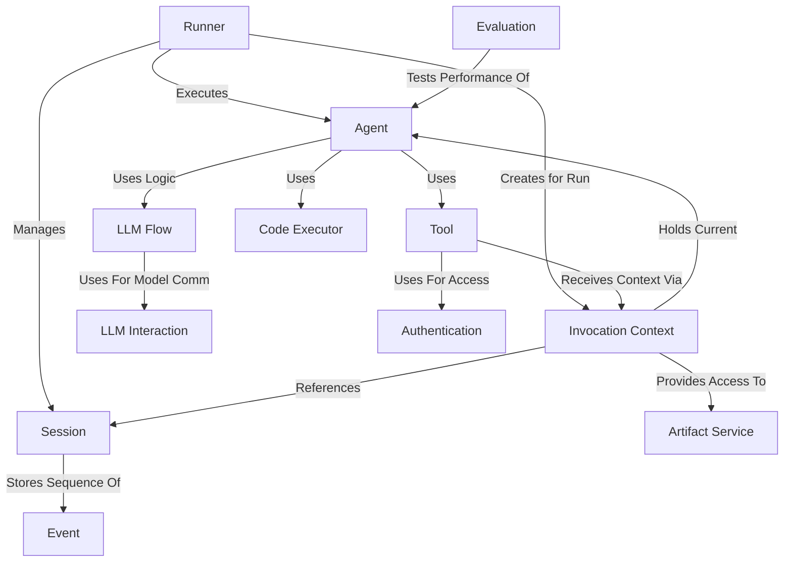

# Tutorial: adk-python

The `adk-python` project provides a framework for building and running *Agents*. Think of an **Agent** as a specialized assistant that can perform tasks, optionally using a Large Language Model (**LLM**) to reason and decide actions.
A **Runner** executes these Agents, managing the conversation *Session* and user interaction. Agents can use **Tools** (like calculators, search engines, or even other Agents) to gain new capabilities. The framework handles the interaction flow, communication with LLMs, state management, and provides ways to evaluate agent performance.

**Source Repository:** [https://github.com/google/adk-python](https://github.com/google/adk-python)

## Chapters

1. [Agent](01_agent.md)
2. [Runner](02_runner.md)
3. [Session](03_session.md)
4. [Tool](04_tool.md)
5. [LLM Flow](05_llm_flow.md)
6. [LLM Interaction](06_llm_interaction.md)
7. [Invocation Context](07_invocation_context.md)
8. [Event](08_event.md)
9. [Code Executor](09_code_executor.md)
10. [Artifact Service](10_artifact_service.md)
11. [Authentication](11_authentication.md)
12. [Evaluation](12_evaluation.md)

---

Generated by [AI Codebase Knowledge Builder](https://github.com/The-Pocket/Tutorial-Codebase-Knowledge)